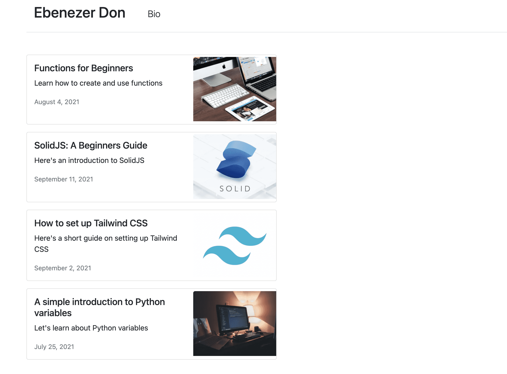

Definitely NextJS has positioned itself as the best React framework at present.

The purpose of this post is to show how easy and intuitive it can be to make a navbar in NextJS with the help of TailwindCSS. 

# Setup and configuration

So, the first thing that we need is install NextJS and tailwindcss. Information captured from [here](https://tailwindcss.com/docs/guides/nextjs)

```shell
$ npx create-next-app blog_demo
$ npm install -D tailwindcss postcss autoprefixer
```


postcss is the tool that tailwind is going to use to purge unwanted css classes. This helps to drastically reduce the final css of the css

It also used `autoprefixer` tool so that our site can look good across multiple deivices

2. Install tailwindcss configuration files for tailwindcss.config.js as well as postcss.config.js

```shell
npx tailwindcss init -p
```

`-p` witch specifies to generate `postcss.config.js`.

If we open postcss.config.js, then you can see two plugins specified: tailwindcss and autoprefixer

3. Open your tailwind.config.js and paste the following content:

```js
module.exports = {
  content: [
    "./pages/**/*.{js,ts,jsx,tsx}",
    "./components/**/*.{js,ts,jsx,tsx}",
  ],
  theme: {
    extend: {},
  },
  plugins: [],
}
```

content entry specifies where to look for tailwindcss utilities classes. As obviously we'll be using them inside of js/jsx file, we specified those entries.

4. There are two ways to incorporate to include the tailwindcss to your project.

   - one by specifying into `globals.css`:

     ```css
     @tailwind base;
     @tailwind components;
     @tailwind utilities;
     ```

  -   Another by specifying in `pages/index.js`. I'll use this approach:

      ```js
      import 'tailwindcss/tailwind.css'
      ```

Before running, let's remove the boiler plate code from inside the `index.js`. Add only following statements inside the `index.js`:

```js
import 'tailwindcss/tailwind.css'

export default function Home() {
    return (
        <h1 className="text-3xl font-bold underline items-center text-green-500">
          Hello world!
        </h1>
      )
}
```

We can rewrite this function as ***arrow function***, which looks more modern:

```js
import 'tailwindcss/tailwind.css'

const Home = () => {
    return (
        <h1 className="text-3xl font-bold underline items-center text-green-500">
          Hello world!
        </h1>
      )
}

export default Home;
```

> Don't forget to `export default` the function. Otherwise, you'll not be able to use it outside.

5. Now, run your node server:

   ```shell
   $ npm run dev
   ```

   Open your browser to `http://localhost:3000/`. You should see following output:

   

## Adding Website title and favicon

`<Head>` tag allows you ti insert data into the HTML `head` tag. You can say it's analogous to HTML `<head>` tag. 

Let's set the page title and the meta tags with its help:

```js
import Head from 'next/head';
import 'tailwindcss/tailwind.css'

const Home = () => {
    return (
        <div>
            <Head>
                <title>My Personal Blog</title>
                <meta name='description' content='My personal Blog on modern software technologies' />
                <link rel='icon' href='/favicon.ico' />
            </Head>
            <h1 className="text-3xl font-bold underline items-center text-green-500">
                Hello world!
            </h1>
        </div>
    )
}

export default Home;
```

## Building NextJS App

Let's conclude our today's discussion by building our NextJS app as:

```shell
$ npm run build
```

You should find your package inside:

`.next\server\`

This is the package, where whole of our application is stored. Open `.next\server\pages\index.html` and you should see the same page as above.


## Setting up Main app

Inside the *./pages/_app.js* file, we’ll remove the default `../styles/global.css` import statement and import the `Head` component from `next/head`. This component injects elements to the `<head>` section of pages:

**import** Head from 'next/head'

Next, let’s replace what we have in the `MyApp` component with this:

```jsx
import Head from 'next/head';


function MyApp({ Component, pageProps }) {
    return (
        <>
            <Head>
                <title>My Personal Blog</title>
                <meta name='description' content='My personal Blog on modern software technologies' />
                <link rel='icon' href='/favicon.ico' />
            </Head>
            <div className="container md:max-w-screen-lg xl:max-w-[1167px] mx-auto ">
                <main className='min-h-screenshadow-sm '>
                    <Component {...pageProps} />
                </main>
            </div>
        </>
    )
}

export default MyApp

```

In the above code, weve given our app the title *Next and MDX Blog*. The `<Component {...pageProps} />` tag represents the content for all our different pages, and we’ve wrapped it in a div with the class `"container"`.

If needed, we can also add custom css inside `Head` section:

```html
<link href="https://cdn.jsdelivr.net/npm/min.css" rel="stylesheet"  integrity="sha384VSTQN3/azprG1Anm3QDgpJLIm9Nao0Yz1ztcQTwFspd3yD65VohhpuuCOmLASjC" crossOrigin="anonymous" />
```


----


# Creating Navbar component

We’ll need a navbar for our blog. Let's create a new component to show responsive navigation bar. Let's name it as `Navbar`:

*Remember that all our components will be stored inside `components` directory.*

First let's create a new directory `components` in our root folder. In the *components* folder, create a new file `Navbar.jsx` and add following content:

```jsx
import { HiMenuAlt4 } from 'react-icons/hi'
import { AiOutlineClose } from 'react-icons/ai'
import { Link } from "react-scroll";
import Image from 'next/image';
import { useState } from 'react';

import logo from '../public/logo.png'

const MenuItems = ["Link1", "Link2", "Link3", "Link4"];

const NavBarItem = ({ title, classprops }) => (
  <li className='border-b md:border-0 w-full py-2'><Link
    activeClass="active"
    to={title}
    spy={true}
    smooth={true}
    offset={-10}
    duration={500}
    className={`cursor-pointer hover:bg-blue-600 text-black hover:text-white px-3 py-2 rounded-md text-sm font-medium ${classprops || ''}`.trim()}
  >
    {title}
  </Link>
  </li>
);

export const Navbar = () => {
  const [isMenuVisible, setMenuVisible] = useState(false)
  return (
    <nav className="bg-slate-50 sticky top-0 z-50 w-full flex justify-between items-center p-4">
      <div className="md:flex-[0.5] flex-initial justify-center items-center">
        <Image src={logo} alt="logo" className="w-32 cursor-pointer" ></Image>
      </div>
      <ul className="md:flex hidden list-none flex-row justify-between items-center flex-initial">
        {MenuItems.map((item, index) => (
          <NavBarItem key={item + index} title={item} />
        ))}
        <li className="bg-[#2952e3] text-white py-2 px-7 mx-4 rounded-full cursor-pointer hover:bg-[#2546bd]">
          Login
        </li>
      </ul>
      <div className="flex relative">
        {!isMenuVisible && (
          <HiMenuAlt4 fontSize={28} className="md:hidden cursor-pointer" onClick={() => setMenuVisible(true)} />
        )}
        {isMenuVisible && (
          <ul
            className="z-10 fixed -top-0 -right-2 p-3 w-[70vw] h-screen shadow-2xl md:hidden list-none flex flex-col justify-start items-end rounded-md blue-glassmorphism animate-slide-in transition"
          >
            <li ><AiOutlineClose fontSize={28} className="m-2 md:hidden cursor-pointer" onClick={() => setMenuVisible(false)} /></li>
            {MenuItems.map(
              (item, index) => <NavBarItem key={item + index} title={item} classprops="my-2 text-lg" />,
            )}
          </ul>
        )}
      </div>
    </nav>
  );
};

```


Install react-icons:

```shell
$ npm install react-icons --save
```

In our *./components/Nav.jsx* file, we started by importing the `Link` component from `'next/link'`. We’ll use this to enable client-side transitions between routes. This means that Next.js will prefetch whichever page we have in the `<Link>` tag as soon as it shows on our current page, so that when we click on the Bio link, we immediately get to see the bio page without having to wait for our application to fetch it again from the server. I’ve used the link with the text *“Ebenezer Don”* to point to our app’s base URL. You can use whatever text you want in yours.

Next, we’ll import the `Nav` component inside the *./pages/_app.js* file and place it in the container div, just before the `<main>` tag:

```jsx
import { Navbar } from '../components/Navbar';

...
      <div className="container...">
        <Navbar />
        <main className='min-h-screenshadow-sm '>
          <Component {...pageProps} />
        </main>
      </div>
...
```


# Create Blog component

For our blog component, let's create a new file named `MainBlog.jsx` inside the `components` and paste the following code inside it:

```jsx
import Link from "next/link";

export const BlogMain = () => {
  return (
    <div className="mt-3">
      <p className="display-4 text-center">Blogs</p>
      <p className="text-center">A central place for my thoughts and learning</p>
      <Link href="/blogs" passHref>
        <p className="cursor-pointer ms-5 pointer lead my-auto">More Blogs</p>
      </Link>
    </div>
  )
}
```

You can change the text and page content to whatever you want. You should see something that looks similar to this:


## Adding MDX files for our posts

In our root directory, let’s create a new folder named *posts*. We’ll use the *posts* folder to house our MDX files. Here’s a [link](https://github.com/ebenezerdon/mdx-files-nextjs-blog) to a GitHub repo that contains the MDX files we’ll need for our app. You’ll see a *posts* folder inside the repository, and inside the *posts* folder you should see the following files:

- *functions-for-beginners.mdx*
- *solidjs-for-beginners.mdx*
- *tailwind-setup.mdx*
- *variables-in-python.mdx*

You can clone the repository or download the MDX files, then create a *posts* folder in the root directory of your app and paste the files there. All of them have similar content, so let’s use the *functions-for-beginners.mdx* file to explain what we’re doing in our MDX posts.

Here’s what our *./posts/functions-for-beginners.mdx* file looks like:

```markdown
---
title: Functions for Beginners
date: 'August 4, 2021'
description: Learn how to create and use functions
thumbnailUrl: '/javascript-functions-thumbnail.jpeg'
tags: ['functions', 'javascript']
---
<div>
  This is a blog post about <strong>functions</strong>. <br/>
  We'll learn what functions are, how to write functions, and how to use them.
</div>
<br/>
### This is a Markdown subheading
We just used a `###` subheading in our blog post.
<SyntaxHighlighter language="javascript">
  {`
    const doStuff = () => {
      return console.log('hey')
    }
  `}
</SyntaxHighlighter>
// this is a code block const doSomething = () => { return console.log('hey') }
<div>Here I'm using a component inside my MarkDown file: {<Button text={"Click me"}/>}</div>
```

Firstly, we’re using the YAML syntax to write our file’s **front matter** which will allow us to store the post’s **metadata**. These are the key-value pairs wrapped in three hyphens (—) at the top of our Markdown file. We’ll be able to access this information later in our app, when we’re processing the Markdown file for our post page.

Inside our front matter, we have a `thumbnailUrl` property for our blog post. Here’s a [link](https://github.com/ebenezerdon/images-next-mdx-tutorial) to the images for this tutorial. You can clone or download them onto your *./public* directory.

Next, you can see that with MDX, we can use HTML tags like the `<div>` tag in our Markdown file.

There’s also the `<SyntaxHighlighter>` component which we’re using to wrap our code block. This is from an npm package named *react-syntax-highlighter*, which enables syntax highlighting for our code. When setting up MDX later in our app, you’ll see how we’re making this component available to our Markdown files. We did the same thing with the `<Button>` component on the last line of our file. Now that we have our MDX files, we can add content to our blog’s homepage. But before we do, let’s create the `<Button/>` component that we’re using in the MDX files.

## Building our blog’s homepage

To add content to our blog’s homepage, we’ll be working with the *./pages/index.js* file.

### Fetching data with the getStaticProps method

In Next.js, we can use a `getStaticProps` method to fetch data at build time. This means that when we build our app, Next.js is going to run the `getStaticProps` method, take the data from it, pass it to our component as props, and then use that to generate the page. Let’s go over to our *./pages/index.js* file and remove the content of our JSX code so that our file looks like this:

```js
import 'tailwindcss/tailwind.css'

const Home = () => {
  return (
    <div>

    </div>
  )
}

export default Home;
```

Next, let’s add a `getStaticProps` method to our *./pages/index.js* file. We’ll do this after the `Home()` function:

```js
...
export const getStaticProps = async () => {
  const files = fs.readdirSync(path.join('posts'))
  const posts = files.map(filename => {
    const markdownWithMeta = fs.readFileSync(path.join('posts', filename), 'utf-8')
    const { data: frontMatter } = matter(markdownWithMeta)
    return {
      frontMatter,
      slug: filename.split('.')[0]
    }
  })
  return {
    props: {
      posts
    }
  }
}
...
```


In our `getStaticProps` function, we started by getting all the filenames inside the *./posts* directory using the Node.js `fs.readdirSync()` method. We went on to create a `posts` variable for housing all our post data. We used the `map` method to map our filenames and then the Node.js `fs.readFileSync()` method to get the data in our individual files. On the next line, we’re using an npm package named *‘gray-matter’* to get our post’s front matter. Our `map` method returns the front matter and post slug, while the `geStaticProps` function returns the post data as props. These props will then be made available to our `Home` component.

Before we use our props to add content to our home page, let’s run the following command to install *gray-matter*:

```shell
$ npm install gray-matter --save
```

Next, we’ll import `fs` from `'fs'`, `path` from `'path'`, and `matter` from `'gray-matter'`:

```js
import fs from 'fs'
import path from 'path'
import matter from 'gray-matter'
```

We’ll also need to import `Link` from `'next/link'`. The `<Link/>` tag is the Next.js way of handling routing.

```js
...

import Link from 'next/link'
```


Now that we have our data and imports ready, let’s add content to our homepage. We’ll update our `Home` component to this:


In our `Home` component, we’ve used the posts prop to populate our page with the post data. We’re using `tailwindcss` styling, and you can see how we’re getting the post `title`, `description`, and `date` from the `frontMatter`. When we restart our dev server and open up our app in the browser, we should see a page that looks like this:



## Building our Post page

Now that we have our homepage ready, let’s work on the single post page. For this, we’ll be using dynamic routing in Next.js. Since we don’t want to create separate pages for all our individual post files, we’ll give Next.js a template page and ask it to generate the individual post pages with it during build time.

### Generating dynamic URLs in Next.js

To generate our posts URLs, let’s create a new folder named *blog* inside our *./pages* directory. Inside our *./pages/blog* directory, we’ll create a new file named *[blog].js*. Notice that our file name is wrapped in square brackets ([]). This is how Next.js will know that we want it to be a dynamic route.

Next.js has a `getStaticPaths()` method for generating our list of paths at build time. Let’s create one inside our *[blog].js* file:

```jsx
export const getStaticPaths = async () => {
  const files = fs.readdirSync(path.join('posts'))
  const paths = files.map(filename => ({
    params: {
      blog: filename.replace('.mdx', '')
    }
  }))
  return {
    paths,
    fallback: false
  }
}
```

Notice that we’re using the Node.js `fs.readdirSync()` method again to get all the file names in our *posts* folder. We want to use the file names, without their *.mdx* extensions as our posts slugs.

> **Note:** variable inside `blog: filename.replace('.mdx', '')` should be same as what you specify for `[blog].js`. That means it should be `blog` at both places. Otherwise, you will get an error.

When a user clicks on a post, we want to redirect them to `our-url/blog/the-post-slug`. So for the file *functions-for-beginners.mdx*, its slug will be *functions-for-beginners*, and the URL will be http://localhost:3000/blog/functions-for-beginners.

In our `getStaticPaths` method, we’re returning our paths variable which contains an object with the property params, which, in turn, has our post slug. We’re setting the fallback property in our return statement to `false` so that any paths not included in our paths list will result in a **404 page**. For example, if a user navigates to https://localhost:3000/blog/some-random-text, they should see a **404 page**.

### Getting our PostPage props with getStaticProps

Now that we have our paths, let’s use `getStaticProps` to get our component props. We’ll create a new function named `getStaticProps` under the `getStaticPaths` method:

```jsx
export const getStaticProps = async ({ params: { blog } }) => {
  const markdownWithMeta = fs.readFileSync(path.join('posts',
    blog + '.mdx'), 'utf-8')

  const { data: frontMatter, content } = matter(markdownWithMeta)
  const mdxSource = await serialize(content)

  return {
    props: {
      frontMatter,
      blog,
      mdxSource
    }
  }
}
```

In our `getStaticProps` function, we’re using the Node.js `fs.readFileSync` method to get our post data in the *./posts* directory, and the `matter` method from gray-matter to extract the front matter. We also have a new method named `serialize`. The `serialize` method is from ‘**next-mdx-remote**‘, an npm package for adding MDX support in our Next.js app. We’re using the serialize method to parse and compile the MDX string so that it can be rendered in our app.

> **Note:** variable inside should be same as what you specify for `[blog].js`. That means it should be `blog` at all places. Otherwise, you will get an error.

Let’s run the following command on our terminal to install next-mdx-remote:

```shell
$ npm install next-mdx-remote --save
```

In addition, install React-syntax-highlighter:

```shell
$ npm install react-syntax-highlighter --save
```


Next, let’s add our import statements to the top of the *./pages/blog/[slug].js* file:

```jsx
import { serialize } from 'next-mdx-remote/serialize'
import { MDXRemote } from 'next-mdx-remote'
import fs from 'fs'
import path from 'path'
import matter from 'gray-matter'
import SyntaxHighlighter from 'react-syntax-highlighter'
```

Notice that we’re also importing a component named `MDXRemote` from the **‘next-mdx-remote**‘ package. We’ll use `<MDXRemote />` to consume the output of `serialize`, so that we can render it directly into the `PostPage` component. The `<MDXRemote />` component also has an optional components prop, which we’ll be using to supply components to our MDX files. It’s how we were able to use the `<SyntaxHighlighter />` component in our *functions-for-beginners.mdx* file. On the last line of the MDX file, we’re also using the `Button` component that we created earlier:

```jsx
// my-first-mdx-file.mdx
...
<div>Here, I'm using a component inside my MarkDown file: 
    {<Button text={"Click me"}/>}
</div>
```

To use it, let's create our `Button` component inside `components` directory.

```jsx
const Button = ({ text }) => {
  return (
    <button
      className="btn btn-primary"
      onClick={event => event.target.innerText = 'You clicked me!'}
    >
      {text}
    </button>
  )
}
export default Button
```

Let's import our `Button` component inside the `./pages/blog/[slug].js` file:

```js
...
import Button from '../../components/Button.jsx'
...
```

Next, we’ll create our `PostPage` component:

```jsx
const PostPage = ({ frontMatter: { title }, mdxSource }) => {
  return (
    <div className="mt-4">
      <h1>{title}</h1>
      <MDXRemote {...mdxSource} components={{ Button, SyntaxHighlighter }} />
    </div>
  )
}
```

In our `PostPage` component, we’re using the front matter from `getStaticProps` to get our post’s title. We’re also using `<MDXRemote />` to render our MDX text. We’ve supplied the `Button` and `SyntaxHighlighter` components as an object value to the components prop.

Finally, let’s export the `PostPage` component as default. We’ll do this at the end of our file:

```jsx
...
export default PostPage
```

Now, when we restart our dev server and navigate to http://localhost:3000/blog/functions-for-beginners, we should see a page that looks like this:


## Create Custom component for `syntax highlighter`

Let's create a new file `Highlighter` inside `components` directory and add following information in there:

```jsx
import { Prism as SyntaxHighlighter } from "react-syntax-highlighter";
import { atomDark as theme } from "react-syntax-highlighter/dist/cjs/styles/prism";

const Highlighter = (props) => {
  const result = props.linesToHighlight.split(",");
  var linesToHighlight = convertLineStrToArray(props.linesToHighlight);

  console.log(props.children);
  return (
    <SyntaxHighlighter
      language={props.language}
      wrapLines={true}
      showLineNumbers={true}
      style={theme}
      children={props.children.trim()}
    />
  );
};
export default Highlighter;

```

### Line highlighting

```jsx

    <SyntaxHighlighter
      ...
      lineProps={(lineNumber) => {
        const style = {
          display: "block",
          width: "100%",
        };
        if (linesToHighlight.includes(lineNumber)) {
          style.backgroundColor = lineHighlight;
          style.borderLeft = "4px solid #3b82f6";
        }
        return { style };
      }}
      children={props.children.trim()}
```

### Using Highlighter Component

```jsx
<Highlighter language="js" linesToHighlight="2-4, 6">
  {` 
const Comp = (props) => {
  const result = props.linesToHighlight.split(",");
  var linesToHighlight = convertLineStrToArray(props.linesToHighlight);
console.log(linesToHighlight);
};
export default Comp;
`}

</Highlighter>
```

However, this doesn't look so nice as is expected from a markdown file. I want it to be more close to markdown syntax

## Hashicorp's next-mdx-remote

The [next-mdx-remote](https://github.com/hashicorp/next-mdx-remote) package by Hashicorp was created to deal with problems that arose from their `next-mdx-enhanced` package.

Unlike the previous plugins, your content can come from anywhere: markdown files, a database, an API, etc. That's because the markdown is loaded through `getServerProps` or `getStaticProps`.

The package does not require global configuration like `@next/mdx` or `next-mdx-enhanced`; instead, you load the `serialize` function and `<MDXRemote />` component on any page you want to use it in. Here is a full example from the project's README.md:

```
import { serialize } from "next-mdx-remote/serialize";
import { MDXRemote } from "next-mdx-remote";

import matter from "gray-matter";

import Test from "../components/test";

const components = { Test };

export default function TestPage({ source, frontMatter }) {
  return (
    <div className="wrapper">
      <h1>{frontMatter.title}</h1>
      <MDXRemote {...source} components={components} />
    </div>
  );
}

export async function getStaticProps() {
  // MDX text - can be from a local file, database, anywhere
  const source = `---
title: Test
--------

Some **mdx** text, with a component <Test name={title}/>
  `;

  const { content, data } = matter(source);
  const mdxSource = await serialize(content, { scope: data });
  return { props: { source: mdxSource, frontMatter: data } };
}
```


### next-mdx-remote Pros:

Perhaps most substantially, `next-mdx-remote` does not suffer from the intense performance issues that `next-mdx-enhanced` suffered from, meaning it's unlikely to run into the 25 minute builds mentioned above.

The `next-mdx-remote` package also supports frontmatter and it supports remote data loading. It does not require changes to the project's `next.config.js` configuration file. Passing in components to the `<MDXRemote />` component is also trivial.

### next-mdx-remote Cons:

There is more "glue code" to write with `next-mdx-remote` than `@next/mdx` or `next-mdx-enhanced` because you aren't leveraging file-based routing.

You also lose out on the nice `next-mdx-enhanced` layouts feature, though it's likely possible to implement a simple version of that feature yourself.


----


# Using React components in MDX documents with Next.js Image

At this point of the project, everything is set up and ready to go, but as one last optional step, we can see how we’re able to take advantage of MDX using React components in our documents.

To test this out, we can simply take advantage of the included [Next.js Image](https://nextjs.org/docs/api-reference/next/image) component right inside of one of our posts.

Let’s open up our Hello World blog post (or any blog post you’d) like, then first import Next.js Image immediately after the frontmatter:

```jsx
import Image from 'next/image'
...
const PostPage = ({ frontMatter: { title }, mdxSource }) => {
...
      <MDXRemote {...mdxSource} components={{ Button, SyntaxHighlighter, Image }} scope={data} />
...
}
```

Then somewhere in the post, we can use the Image component with any image we’d like:

```jsx
<Image width={500} height={500} src="https://www.nasa.gov/sites/default/files/1-bluemarble_west.jpg" />
```

> Note: MDX requires whitespace around the components, so make sure there’s a return before and after the Image reference.

If you’re following along with me we should end up with:

```
---
title: 'Hello, world!'
layout: 'post'
---

This is my first post!

<Image width={500} height={500} src="https://www.nasa.gov/sites/default/files/1-bluemarble_west.jpg" />
```

As we're accessing image from outside. So Next.js will block our access to this url. As a final step, we need to include the hostname of the image URL we're using inside of our Next.js config.

Inside of `next.config.js`, we want to add image config. Specify the domain/hostname from where we want to access the image.

```js
module.exports = {
  images: {
    domains: ['www.nasa.gov'],
  },
...
}
```


------

# Fetching Reading time

`reading-time` helps you estimate how long an article will take to read. It works perfectly with plain text, but also with `markdown` or `html`.

## Installation

```shell
npm install reading-time --save
```

Include

```jsx
import readingTime from 'reading-time'

```

Fetch stats

```jsx
export const getStaticProps = async ({ params: { blog } }) => {
  ...
  const { data: frontMatter, content } = matter(markdownWithMeta)

  const stats = readingTime(content)
  ...
    return {
    props: {
      frontMatter,
      mdxSource,
      stats
    }
  }
}
```

Receive and Print the stats

```jsx
const PostPage = ({ frontMatter, mdxSource, stats }) => {
  return (
    <div className="mt-4">
      ...
      <p>{stats.text}</p>
	  ...
    </div>
  )
}
```

## Alternative way

We can club reading-time stats with frontMatter

```jsx
export const getStaticProps = async ({ params: { blog } }) => {
  ..
  const { data: frontMatter, content } = matter(markdownWithMeta)
  ..
  return {
    props: {
      frontMatter: {
        readingTime: readingTime(content),
        ...frontMatter
      },
      mdxSource
    }
  }
}
```

Now, fetch single `frontMatter` object unlike before where we received two objects in `PostPPage` component:

```jsx
const PostPage = ({ frontMatter, mdxSource }) => {
  return (
    <div className="mt-4">
      ...
      <p>{frontMatter.readingTime.text}</p>
      ...
}
      
```

