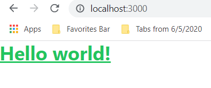

Definitely NextJS has positioned itself as the best React framework at present.

The purpose of this post is to show how easy and intuitive it can be to make a navbar in NextJS with the help of TailwindCSS. 

# Setup and configuration

So, the first thing that we need is install NextJS and tailwindcss. Information captured from [here](https://tailwindcss.com/docs/guides/nextjs)

```shell
$ npx create-next-app blog_demo
$ npm install -D tailwindcss postcss autoprefixer
```


postcss is the tool that tailwind is going to use to purge unwanted css classes. This helps to drastically reduce the final css of the css

It also used `autoprefixer` tool so that our site can look good across multiple deivices

2. Install tailwindcss configuration files for tailwindcss.config.js as well as postcss.config.js

```shell
npx tailwindcss init -p
```

`-p` witch specifies to generate `postcss.config.js`.

If we open postcss.config.js, then you can see two plugins specified: tailwindcss and autoprefixer

3. Open your tailwind.config.js and paste the following content:

```js
module.exports = {
  content: [
    "./pages/**/*.{js,ts,jsx,tsx}",
    "./components/**/*.{js,ts,jsx,tsx}",
  ],
  theme: {
    extend: {},
  },
  plugins: [],
}
```

content entry specifies where to look for tailwindcss utilities classes. As obviously we'll be using them inside of js/jsx file, we specified those entries.

4. There are two ways to incorporate to include the tailwindcss to your project.

   - one by specifying into `globals.css`:

     ```css
     @tailwind base;
     @tailwind components;
     @tailwind utilities;
     ```

  -   Another by specifying in `pages/index.js`. I'll use this approach:

      ```js
      import 'tailwindcss/tailwind.css'
      ```

Before running, let's remove the boiler plate code from inside the `index.js`. Add only following statements inside the `index.js`:

```js
import 'tailwindcss/tailwind.css'

export default function Home() {
    return (
        <h1 className="text-3xl font-bold underline items-center text-green-500">
          Hello world!
        </h1>
      )
}
```

We can rewrite this function as ***arrow function***, which looks more modern:

```js
import 'tailwindcss/tailwind.css'

const Home = () => {
    return (
        <h1 className="text-3xl font-bold underline items-center text-green-500">
          Hello world!
        </h1>
      )
}

export default Home;
```

> Don't forget to `export default` the function. Otherwise, you'll not be able to use it outside.

5. Now, run your node server:

   ```shell
   $ npm run dev
   ```

   Open your browser to `http://localhost:3000/`. You should see following output:

   

## Adding Website title and favicon

`<Head>` tag allows you ti insert data into the HTML `head` tag. You can say it's analogous to HTML `<head>` tag. 

Let's set the page title and the meta tags with its help:

```js
import Head from 'next/head';
import 'tailwindcss/tailwind.css'

const Home = () => {
    return (
        <div>
            <Head>
                <title>My Personal Blog</title>
                <meta name='description' content='My personal Blog on modern software technologies' />
                <link rel='icon' href='/favicon.ico' />
            </Head>
            <h1 className="text-3xl font-bold underline items-center text-green-500">
                Hello world!
            </h1>
        </div>
    )
}

export default Home;
```

## Building NextJS App

Let's conclude our today's discussion by building our NextJS app as:

```shell
$ npm run build
```

You should find your package inside:

`.next\server\`

This is the package, where whole of our application is stored. Open `.next\server\pages\index.html` and you should see the same page as above.


----


# Creating Navbar component

Let's create a new component to show responsive navigation bar. Let's name it as `Navbar`:

*Remember that all our components will be stored inside `components` directory.*

First let's create a new directory `components` in our root folder. Then create a new file `components/Navbar.jsx` and add following content:

```jsx
```


Install react-icons:

```shell
$ npm install react-icons --save
```

