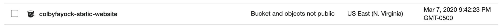
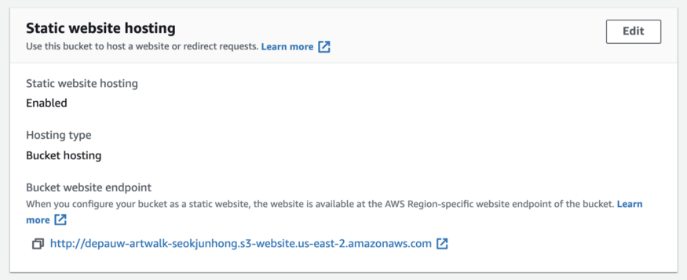
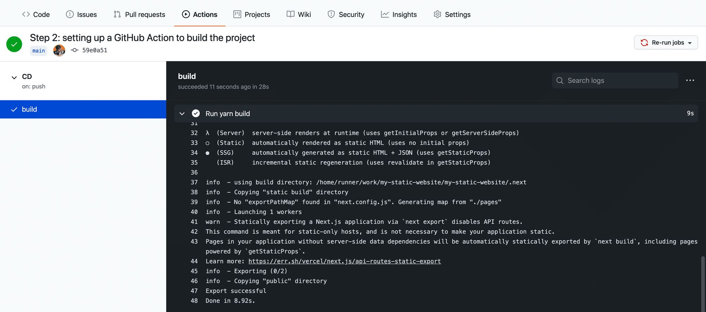
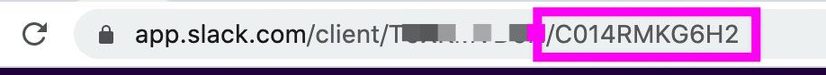

Definitely NextJS has positioned itself as the best React framework at present.

The purpose of this post is to show how easy and intuitive it can be to make a navbar in NextJS with the help of TailwindCSS. 

# Setup and configuration

So, the first thing that we need is install NextJS and tailwindcss. Information captured from [here](https://tailwindcss.com/docs/guides/nextjs)

```shell
$ npx create-next-app blog_demo
$ npm install -D tailwindcss postcss autoprefixer
```


postcss is the tool that tailwind is going to use to purge unwanted css classes. This helps to drastically reduce the final css of the css

It also used `autoprefixer` tool so that our site can look good across multiple deivices

2. Install tailwindcss configuration files for tailwindcss.config.js as well as postcss.config.js

```shell
npx tailwindcss init -p
```

`-p` witch specifies to generate `postcss.config.js`.

If we open postcss.config.js, then you can see two plugins specified: tailwindcss and autoprefixer

3. Open your tailwind.config.js and paste the following content:

```js
module.exports = {
  content: [
    "./pages/**/*.{js,ts,jsx,tsx}",
    "./components/**/*.{js,ts,jsx,tsx}",
  ],
  theme: {
    extend: {},
  },
  plugins: [],
}
```

content entry specifies where to look for tailwindcss utilities classes. As obviously we'll be using them inside of js/jsx file, we specified those entries.

4. There are two ways to incorporate to include the tailwindcss to your project.

   - one by specifying into `globals.css`:

     ```css
     @tailwind base;
     @tailwind components;
     @tailwind utilities;
     ```

  -   Another by specifying in `pages/index.js`. I'll use this approach:

      ```js
      import 'tailwindcss/tailwind.css'
      ```

Before running, let's remove the boiler plate code from inside the `index.js`. Add only following statements inside the `index.js`:

```js
import 'tailwindcss/tailwind.css'

export default function Home() {
    return (
        <h1 className="text-3xl font-bold underline items-center text-green-500">
          Hello world!
        </h1>
      )
}
```

We can rewrite this function as ***arrow function***, which looks more modern:

```js
import 'tailwindcss/tailwind.css'

const Home = () => {
    return (
        <h1 className="text-3xl font-bold underline items-center text-green-500">
          Hello world!
        </h1>
      )
}

export default Home;
```

> Don't forget to `export default` the function. Otherwise, you'll not be able to use it outside.

5. Now, run your node server:

   ```shell
   $ npm run dev
   ```

   Open your browser to `http://localhost:3000/`. You should see following output:

   

## Adding Website title and favicon

`<Head>` tag allows you ti insert data into the HTML `head` tag. You can say it's analogous to HTML `<head>` tag. 

Let's set the page title and the meta tags with its help:

```js
import Head from 'next/head';
import 'tailwindcss/tailwind.css'

const Home = () => {
    return (
        <div>
            <Head>
                <title>My Personal Blog</title>
                <meta name='description' content='My personal Blog on modern software technologies' />
                <link rel='icon' href='/favicon.ico' />
            </Head>
            <h1 className="text-3xl font-bold underline items-center text-green-500">
                Hello world!
            </h1>
        </div>
    )
}

export default Home;
```

## Building NextJS App

Let's conclude our today's discussion by building our NextJS app as:

```shell
$ npm run build
```

You should find your package inside:

`.next\server\`

This is the package, where whole of our application is stored. Open `.next\server\pages\index.html` and you should see the same page as above.


## Setting up Main app

Inside the *./pages/_app.js* file, we’ll remove the default `../styles/global.css` import statement and import the `Head` component from `next/head`. This component injects elements to the `<head>` section of pages:

**import** Head from 'next/head'

Next, let’s replace what we have in the `MyApp` component with this:

```jsx
import Head from 'next/head';


function MyApp({ Component, pageProps }) {
    return (
        <>
            <Head>
                <title>My Personal Blog</title>
                <meta name='description' content='My personal Blog on modern software technologies' />
                <link rel='icon' href='/favicon.ico' />
            </Head>
            <div className="container md:max-w-screen-lg xl:max-w-[1167px] mx-auto ">
                <main className='min-h-screenshadow-sm '>
                    <Component {...pageProps} />
                </main>
            </div>
        </>
    )
}

export default MyApp

```

In the above code, weve given our app the title *Next and MDX Blog*. The `<Component {...pageProps} />` tag represents the content for all our different pages, and we’ve wrapped it in a div with the class `"container"`.

If needed, we can also add custom css inside `Head` section:

```html
<link href="https://cdn.jsdelivr.net/npm/min.css" rel="stylesheet"  integrity="sha384VSTQN3/azprG1Anm3QDgpJLIm9Nao0Yz1ztcQTwFspd3yD65VohhpuuCOmLASjC" crossOrigin="anonymous" />
```


----


# Creating Navbar component

We’ll need a navbar for our blog. Let's create a new component to show responsive navigation bar. Let's name it as `Navbar`:

*Remember that all our components will be stored inside `components` directory.*

First let's create a new directory `components` in our root folder. In the *components* folder, create a new file `Navbar.jsx` and add following content:

```jsx
import { HiMenuAlt4 } from 'react-icons/hi'
import { AiOutlineClose } from 'react-icons/ai'
import { Link } from "react-scroll";
import Image from 'next/image';
import { useState } from 'react';

import logo from '../public/logo.png'

const MenuItems = ["Link1", "Link2", "Link3", "Link4"];

const NavBarItem = ({ title, classprops }) => (
  <li className='border-b md:border-0 w-full py-2'><Link
    activeClass="active"
    to={title}
    spy={true}
    smooth={true}
    offset={-10}
    duration={500}
    className={`cursor-pointer hover:bg-blue-600 text-black hover:text-white px-3 py-2 rounded-md text-sm font-medium ${classprops || ''}`.trim()}
  >
    {title}
  </Link>
  </li>
);

export const Navbar = () => {
  const [isMenuVisible, setMenuVisible] = useState(false)
  return (
    <nav className="bg-slate-50 sticky top-0 z-50 w-full flex justify-between items-center p-4">
      <div className="md:flex-[0.5] flex-initial justify-center items-center">
        <Image src={logo} alt="logo" className="w-32 cursor-pointer" ></Image>
      </div>
      <ul className="md:flex hidden list-none flex-row justify-between items-center flex-initial">
        {MenuItems.map((item, index) => (
          <NavBarItem key={item + index} title={item} />
        ))}
        <li className="bg-[#2952e3] text-white py-2 px-7 mx-4 rounded-full cursor-pointer hover:bg-[#2546bd]">
          Login
        </li>
      </ul>
      <div className="flex relative">
        {!isMenuVisible && (
          <HiMenuAlt4 fontSize={28} className="md:hidden cursor-pointer" onClick={() => setMenuVisible(true)} />
        )}
        {isMenuVisible && (
          <ul
            className="z-10 fixed -top-0 -right-2 p-3 w-[70vw] h-screen shadow-2xl md:hidden list-none flex flex-col justify-start items-end rounded-md blue-glassmorphism animate-slide-in transition"
          >
            <li ><AiOutlineClose fontSize={28} className="m-2 md:hidden cursor-pointer" onClick={() => setMenuVisible(false)} /></li>
            {MenuItems.map(
              (item, index) => <NavBarItem key={item + index} title={item} classprops="my-2 text-lg" />,
            )}
          </ul>
        )}
      </div>
    </nav>
  );
};

```


Install react-icons:

```shell
$ npm install react-icons --save
```

In our *./components/Nav.jsx* file, we started by importing the `Link` component from `'next/link'`. We’ll use this to enable client-side transitions between routes. This means that Next.js will prefetch whichever page we have in the `<Link>` tag as soon as it shows on our current page, so that when we click on the Bio link, we immediately get to see the bio page without having to wait for our application to fetch it again from the server. I’ve used the link with the text *“Ebenezer Don”* to point to our app’s base URL. You can use whatever text you want in yours.

Next, we’ll import the `Nav` component inside the *./pages/_app.js* file and place it in the container div, just before the `<main>` tag:

```jsx
import { Navbar } from '../components/Navbar';

...
      <div className="container...">
        <Navbar />
        <main className='min-h-screenshadow-sm '>
          <Component {...pageProps} />
        </main>
      </div>
...
```


# Create Blog component

For our blog component, let's create a new file named `MainBlog.jsx` inside the `components` and paste the following code inside it:

```jsx
import Link from "next/link";

export const BlogMain = () => {
  return (
    <div className="mt-3">
      <p className="display-4 text-center">Blogs</p>
      <p className="text-center">A central place for my thoughts and learning</p>
      <Link href="/blogs" passHref>
        <p className="cursor-pointer ms-5 pointer lead my-auto">More Blogs</p>
      </Link>
    </div>
  )
}
```

You can change the text and page content to whatever you want. You should see something that looks similar to this:


## Adding MDX files for our posts

In our root directory, let’s create a new folder named *posts*. We’ll use the *posts* folder to house our MDX files. Here’s a [link](https://github.com/ebenezerdon/mdx-files-nextjs-blog) to a GitHub repo that contains the MDX files we’ll need for our app. You’ll see a *posts* folder inside the repository, and inside the *posts* folder you should see the following files:

- *functions-for-beginners.mdx*
- *solidjs-for-beginners.mdx*
- *tailwind-setup.mdx*
- *variables-in-python.mdx*

You can clone the repository or download the MDX files, then create a *posts* folder in the root directory of your app and paste the files there. All of them have similar content, so let’s use the *functions-for-beginners.mdx* file to explain what we’re doing in our MDX posts.

Here’s what our *./posts/functions-for-beginners.mdx* file looks like:

```markdown
---
title: Functions for Beginners
date: 'August 4, 2021'
description: Learn how to create and use functions
thumbnailUrl: '/javascript-functions-thumbnail.jpeg'
tags: ['functions', 'javascript']
---
<div>
  This is a blog post about <strong>functions</strong>. <br/>
  We'll learn what functions are, how to write functions, and how to use them.
</div>
<br/>
### This is a Markdown subheading
We just used a `###` subheading in our blog post.
<SyntaxHighlighter language="javascript">
  {`
    const doStuff = () => {
      return console.log('hey')
    }
  `}
</SyntaxHighlighter>
// this is a code block const doSomething = () => { return console.log('hey') }
<div>Here I'm using a component inside my MarkDown file: {<Button text={"Click me"}/>}</div>
```

Firstly, we’re using the YAML syntax to write our file’s **front matter** which will allow us to store the post’s **metadata**. These are the key-value pairs wrapped in three hyphens (—) at the top of our Markdown file. We’ll be able to access this information later in our app, when we’re processing the Markdown file for our post page.

Inside our front matter, we have a `thumbnailUrl` property for our blog post. Here’s a [link](https://github.com/ebenezerdon/images-next-mdx-tutorial) to the images for this tutorial. You can clone or download them onto your *./public* directory.

Next, you can see that with MDX, we can use HTML tags like the `<div>` tag in our Markdown file.

There’s also the `<SyntaxHighlighter>` component which we’re using to wrap our code block. This is from an npm package named *react-syntax-highlighter*, which enables syntax highlighting for our code. When setting up MDX later in our app, you’ll see how we’re making this component available to our Markdown files. We did the same thing with the `<Button>` component on the last line of our file. Now that we have our MDX files, we can add content to our blog’s homepage. But before we do, let’s create the `<Button/>` component that we’re using in the MDX files.

## Building our blog’s homepage

To add content to our blog’s homepage, we’ll be working with the *./pages/index.js* file.

### Fetching data with the getStaticProps method

In Next.js, we can use a `getStaticProps` method to fetch data at build time. This means that when we build our app, Next.js is going to run the `getStaticProps` method, take the data from it, pass it to our component as props, and then use that to generate the page. Let’s go over to our *./pages/index.js* file and remove the content of our JSX code so that our file looks like this:

```js
import 'tailwindcss/tailwind.css'

const Home = () => {
  return (
    <div>

    </div>
  )
}

export default Home;
```

Next, let’s add a `getStaticProps` method to our *./pages/index.js* file. We’ll do this after the `Home()` function:

```js
...
export const getStaticProps = async () => {
  const files = fs.readdirSync(path.join('posts'))
  const posts = files.map(filename => {
    const markdownWithMeta = fs.readFileSync(path.join('posts', filename), 'utf-8')
    const { data: frontMatter } = matter(markdownWithMeta)
    return {
      frontMatter,
      slug: filename.split('.')[0]
    }
  })
  return {
    props: {
      posts
    }
  }
}
...
```


In our `getStaticProps` function, we started by getting all the filenames inside the *./posts* directory using the Node.js `fs.readdirSync()` method. We went on to create a `posts` variable for housing all our post data. We used the `map` method to map our filenames and then the Node.js `fs.readFileSync()` method to get the data in our individual files. On the next line, we’re using an npm package named *‘gray-matter’* to get our post’s front matter. Our `map` method returns the front matter and post slug, while the `geStaticProps` function returns the post data as props. These props will then be made available to our `Home` component.

Before we use our props to add content to our home page, let’s run the following command to install *gray-matter*:

```shell
$ npm install gray-matter --save
```

Next, we’ll import `fs` from `'fs'`, `path` from `'path'`, and `matter` from `'gray-matter'`:

```js
import fs from 'fs'
import path from 'path'
import matter from 'gray-matter'
```

We’ll also need to import `Link` from `'next/link'`. The `<Link/>` tag is the Next.js way of handling routing.

```js
...

import Link from 'next/link'
```


Now that we have our data and imports ready, let’s add content to our homepage. We’ll update our `Home` component to this:


In our `Home` component, we’ve used the posts prop to populate our page with the post data. We’re using `tailwindcss` styling, and you can see how we’re getting the post `title`, `description`, and `date` from the `frontMatter`. When we restart our dev server and open up our app in the browser, we should see a page that looks like this:


## Building our Post page

Now that we have our homepage ready, let’s work on the single post page. For this, we’ll be using dynamic routing in Next.js. Since we don’t want to create separate pages for all our individual post files, we’ll give Next.js a template page and ask it to generate the individual post pages with it during build time.

### Generating dynamic URLs in Next.js

To generate our posts URLs, let’s create a new folder named *blog* inside our *./pages* directory. Inside our *./pages/blog* directory, we’ll create a new file named *[blog].js*. Notice that our file name is wrapped in square brackets ([]). This is how Next.js will know that we want it to be a dynamic route.

Next.js has a `getStaticPaths()` method for generating our list of paths at build time. Let’s create one inside our *[blog].js* file:

```jsx
export const getStaticPaths = async () => {
  const files = fs.readdirSync(path.join('posts'))
  const paths = files.map(filename => ({
    params: {
      blog: filename.replace('.mdx', '')
    }
  }))
  return {
    paths,
    fallback: false
  }
}
```

Notice that we’re using the Node.js `fs.readdirSync()` method again to get all the file names in our *posts* folder. We want to use the file names, without their *.mdx* extensions as our posts slugs.

> **Note:** variable inside `blog: filename.replace('.mdx', '')` should be same as what you specify for `[blog].js`. That means it should be `blog` at both places. Otherwise, you will get an error.

When a user clicks on a post, we want to redirect them to `our-url/blog/the-post-slug`. So for the file *functions-for-beginners.mdx*, its slug will be *functions-for-beginners*, and the URL will be http://localhost:3000/blog/functions-for-beginners.

In our `getStaticPaths` method, we’re returning our paths variable which contains an object with the property params, which, in turn, has our post slug. We’re setting the fallback property in our return statement to `false` so that any paths not included in our paths list will result in a **404 page**. For example, if a user navigates to https://localhost:3000/blog/some-random-text, they should see a **404 page**.

### Getting our PostPage props with getStaticProps

Now that we have our paths, let’s use `getStaticProps` to get our component props. We’ll create a new function named `getStaticProps` under the `getStaticPaths` method:

```jsx
export const getStaticProps = async ({ params: { blog } }) => {
  const markdownWithMeta = fs.readFileSync(path.join('posts',
    blog + '.mdx'), 'utf-8')

  const { data: frontMatter, content } = matter(markdownWithMeta)
  const mdxSource = await serialize(content)

  return {
    props: {
      frontMatter,
      blog,
      mdxSource
    }
  }
}
```

In our `getStaticProps` function, we’re using the Node.js `fs.readFileSync` method to get our post data in the *./posts* directory, and the `matter` method from gray-matter to extract the front matter. We also have a new method named `serialize`. The `serialize` method is from ‘**next-mdx-remote**‘, an npm package for adding MDX support in our Next.js app. We’re using the serialize method to parse and compile the MDX string so that it can be rendered in our app.

> **Note:** variable inside should be same as what you specify for `[blog].js`. That means it should be `blog` at all places. Otherwise, you will get an error.

Let’s run the following command on our terminal to install next-mdx-remote:

```shell
$ npm install next-mdx-remote --save
```

In addition, install React-syntax-highlighter:

```shell
$ npm install react-syntax-highlighter --save
```


Next, let’s add our import statements to the top of the *./pages/blog/[slug].js* file:

```jsx
import { serialize } from 'next-mdx-remote/serialize'
import { MDXRemote } from 'next-mdx-remote'
import fs from 'fs'
import path from 'path'
import matter from 'gray-matter'
import SyntaxHighlighter from 'react-syntax-highlighter'
```

Notice that we’re also importing a component named `MDXRemote` from the **‘next-mdx-remote**‘ package. We’ll use `<MDXRemote />` to consume the output of `serialize`, so that we can render it directly into the `PostPage` component. The `<MDXRemote />` component also has an optional components prop, which we’ll be using to supply components to our MDX files. It’s how we were able to use the `<SyntaxHighlighter />` component in our *functions-for-beginners.mdx* file. On the last line of the MDX file, we’re also using the `Button` component that we created earlier:

```jsx
// my-first-mdx-file.mdx
...
<div>Here, I'm using a component inside my MarkDown file: 
    {<Button text={"Click me"}/>}
</div>
```

To use it, let's create our `Button` component inside `components` directory.

```jsx
const Button = ({ text }) => {
  return (
    <button
      className="btn btn-primary"
      onClick={event => event.target.innerText = 'You clicked me!'}
    >
      {text}
    </button>
  )
}
export default Button
```

Let's import our `Button` component inside the `./pages/blog/[slug].js` file:

```js
...
import Button from '../../components/Button.jsx'
...
```

Next, we’ll create our `PostPage` component:

```jsx
const PostPage = ({ frontMatter: { title }, mdxSource }) => {
  return (
    <div className="mt-4">
      <h1>{title}</h1>
      <MDXRemote {...mdxSource} components={{ Button, SyntaxHighlighter }} />
    </div>
  )
}
```

In our `PostPage` component, we’re using the front matter from `getStaticProps` to get our post’s title. We’re also using `<MDXRemote />` to render our MDX text. We’ve supplied the `Button` and `SyntaxHighlighter` components as an object value to the components prop.

Finally, let’s export the `PostPage` component as default. We’ll do this at the end of our file:

```jsx
...
export default PostPage
```

Now, when we restart our dev server and navigate to http://localhost:3000/blog/functions-for-beginners, we should see a page that looks like this:


## Create Custom component for `syntax highlighter`

Let's create a new file `Highlighter` inside `components` directory and add following information in there:

```jsx
import { Prism as SyntaxHighlighter } from "react-syntax-highlighter";
import { atomDark as theme } from "react-syntax-highlighter/dist/cjs/styles/prism";

const Highlighter = (props) => {
  const result = props.linesToHighlight.split(",");
  var linesToHighlight = convertLineStrToArray(props.linesToHighlight);

  console.log(props.children);
  return (
    <SyntaxHighlighter
      language={props.language}
      wrapLines={true}
      showLineNumbers={true}
      style={theme}
      children={props.children.trim()}
    />
  );
};
export default Highlighter;

```

### Line highlighting

```jsx

    <SyntaxHighlighter
      ...
      lineProps={(lineNumber) => {
        const style = {
          display: "block",
          width: "100%",
        };
        if (linesToHighlight.includes(lineNumber)) {
          style.backgroundColor = lineHighlight;
          style.borderLeft = "4px solid #3b82f6";
        }
        return { style };
      }}
      children={props.children.trim()}
```

### Using Highlighter Component

```jsx
<Highlighter language="js" linesToHighlight="2-4, 6">
  {` 
const Comp = (props) => {
  const result = props.linesToHighlight.split(",");
  var linesToHighlight = convertLineStrToArray(props.linesToHighlight);
console.log(linesToHighlight);
};
export default Comp;
`}

</Highlighter>
```

However, this doesn't look so nice as is expected from a markdown file. I want it to be more close to markdown syntax

## Hashicorp's next-mdx-remote

The [next-mdx-remote](https://github.com/hashicorp/next-mdx-remote) package by Hashicorp was created to deal with problems that arose from their `next-mdx-enhanced` package.

Unlike the previous plugins, your content can come from anywhere: markdown files, a database, an API, etc. That's because the markdown is loaded through `getServerProps` or `getStaticProps`.

The package does not require global configuration like `@next/mdx` or `next-mdx-enhanced`; instead, you load the `serialize` function and `<MDXRemote />` component on any page you want to use it in. Here is a full example from the project's README.md:

```
import { serialize } from "next-mdx-remote/serialize";
import { MDXRemote } from "next-mdx-remote";

import matter from "gray-matter";

import Test from "../components/test";

const components = { Test };

export default function TestPage({ source, frontMatter }) {
  return (
    <div className="wrapper">
      <h1>{frontMatter.title}</h1>
      <MDXRemote {...source} components={components} />
    </div>
  );
}

export async function getStaticProps() {
  // MDX text - can be from a local file, database, anywhere
  const source = `---
title: Test
--------

Some **mdx** text, with a component <Test name={title}/>
  `;

  const { content, data } = matter(source);
  const mdxSource = await serialize(content, { scope: data });
  return { props: { source: mdxSource, frontMatter: data } };
}
```


### next-mdx-remote Pros:

Perhaps most substantially, `next-mdx-remote` does not suffer from the intense performance issues that `next-mdx-enhanced` suffered from, meaning it's unlikely to run into the 25 minute builds mentioned above.

The `next-mdx-remote` package also supports frontmatter and it supports remote data loading. It does not require changes to the project's `next.config.js` configuration file. Passing in components to the `<MDXRemote />` component is also trivial.

### next-mdx-remote Cons:

There is more "glue code" to write with `next-mdx-remote` than `@next/mdx` or `next-mdx-enhanced` because you aren't leveraging file-based routing.

You also lose out on the nice `next-mdx-enhanced` layouts feature, though it's likely possible to implement a simple version of that feature yourself.


----


# Using React components in MDX documents with Next.js Image

At this point of the project, everything is set up and ready to go, but as one last optional step, we can see how we’re able to take advantage of MDX using React components in our documents.

To test this out, we can simply take advantage of the included [Next.js Image](https://nextjs.org/docs/api-reference/next/image) component right inside of one of our posts.

Let’s open up our Hello World blog post (or any blog post you’d) like, then first import Next.js Image immediately after the frontmatter:

```jsx
import Image from 'next/image'
...
const PostPage = ({ frontMatter: { title }, mdxSource }) => {
...
      <MDXRemote {...mdxSource} components={{ Button, SyntaxHighlighter, Image }} scope={data} />
...
}
```

Then somewhere in the post, we can use the Image component with any image we’d like:

```jsx
<Image width={500} height={500} src="https://www.nasa.gov/sites/default/files/1-bluemarble_west.jpg" />
```

> Note: MDX requires whitespace around the components, so make sure there’s a return before and after the Image reference.

If you’re following along with me we should end up with:

```
---
title: 'Hello, world!'
layout: 'post'
---

This is my first post!

<Image width={500} height={500} src="https://www.nasa.gov/sites/default/files/1-bluemarble_west.jpg" />
```

As we're accessing image from outside. So Next.js will block our access to this url. As a final step, we need to include the hostname of the image URL we're using inside of our Next.js config.

Inside of `next.config.js`, we want to add image config. Specify the domain/hostname from where we want to access the image.

```js
module.exports = {
  images: {
    domains: ['www.nasa.gov'],
  },
...
}
```


------

# Fetching Reading time

`reading-time` helps you estimate how long an article will take to read. It works perfectly with plain text, but also with `markdown` or `html`.

## Installation

```shell
npm install reading-time --save
```

Include

```jsx
import readingTime from 'reading-time'

```

Fetch stats

```jsx
export const getStaticProps = async ({ params: { blog } }) => {
  ...
  const { data: frontMatter, content } = matter(markdownWithMeta)

  const stats = readingTime(content)
  ...
    return {
    props: {
      frontMatter,
      mdxSource,
      stats
    }
  }
}
```

Receive and Print the stats

```jsx
const PostPage = ({ frontMatter, mdxSource, stats }) => {
  return (
    <div className="mt-4">
      ...
      <p>{stats.text}</p>
	  ...
    </div>
  )
}
```

## Alternative way

We can club reading-time stats with frontMatter

```jsx
export const getStaticProps = async ({ params: { blog } }) => {
  ..
  const { data: frontMatter, content } = matter(markdownWithMeta)
  ..
  return {
    props: {
      frontMatter: {
        readingTime: readingTime(content),
        ...frontMatter
      },
      mdxSource
    }
  }
}
```

Now, fetch single `frontMatter` object unlike before where we received two objects in `PostPPage` component:

```jsx
const PostPage = ({ frontMatter, mdxSource }) => {
  return (
    <div className="mt-4">
      ...
      <p>{frontMatter.readingTime.text}</p>
      ...
}
      
```


------


# ToC

[Generate IDs for all headings automatically with rehype-slug](https://mikebifulco.com/posts/mdx-auto-link-headings-with-rehype-slug#step-1-generate-ids-for-all-headings-automatically-with-rehype-slug)

[`rehype-slug`](https://github.com/rehypejs/rehype-slug) is a plugin that works with MDX, and will automatically generate IDs for your headings by generating a slug based on the text they contain.

1. Install `rehype-slug` in your project by running `npm install --save rehype-slug` or `yarn add rehype-slug`
2. Add `rehype-slug` to the list of rehype plugins MDX uses. In the case of next.js sites, it is likely wherever you call `serialize()` from `next-mdx-remote`.

```jsx
export const getStaticProps = async ({ params: { blog } }) => {
  ...
  const options = {
    mdxOptions: {
      rehypePlugins: [
        rehypeSlug, // add IDs to any h1-h6 tag that doesn't have one, using a slug made from its text
      ],
    },
  };

  const mdxSource = await serialize(content, options);
  ...
}
```

At this point, if you fire up your dev environment, and use your browser devtools to inspect any of the headings generated from markdown for your site, they should all have an `id` property added. For the example above, you'd see:

```html
<h1 id="a-fish-called-wanda">A fish called wanda</h1>
```

We're halfway there - you can now link to `www.example.com#a-fish-called-wanda`, and the browser will automatically scroll to the heading.


-------------

# Create A Multi-Page Website

Here we will discuss the steps to create a multi-page website with Next.js. You might get confused a bit while reading this because  we know that React.js is designed to build Single Page Applications(SPA). 

Actually, we are creating a next.js app with multiple routes instead of multiple pages. But for the user, it feels the same as multiple pages.

Here we are going to create 3 routes **/**, **/about**, and **/contact** which renders its corresponding components. From in user’s perspective, it feels the same as opening the corresponding page for each route.

| **Route** | **Corresponding page** |
| --------- | ---------------------- |
| /         | Home page              |
| /about    | About page             |
| /contact  | Contact page           |

## Building the route components/pages

After creating a new Next.js project, we need to create route components. When coming to Next.js, we usually call them pages.

Anyways, when accessing the routes, these components must render.

So we need to create an **about.js**, **contact.js**, and an **index.js** file inside the pages directory.

The complete file structure of the app we have built is shown below.


## About page

This component is rendered when accessing the **/about** the route. It consists of a **title** and a **description**. We also added a **CSS** file to style the component.

So, create an **about.js** file inside the **pages** directory and add the below code.

```
// pages/about.js

import React from "react";
import styles from '../styles/About.module.css'

export default function About(){
    return(
        <div className={styles.container}>
            <h2 className={styles.title}>About Page</h2>
            <p className={styles.description}>
            Lorem Ipsum is simply dummy text of the printing and typesetting industry. Lorem Ipsum has been the industry's standard dummy text ever since the 1500s, when an unknown printer took a galley of type and scrambled it to make a type specimen book. It has survived not only five centuries, but also the leap into electronic typesetting, remaining essentially unchanged. It was popularised in the 1960s with the release of Letraset sheets containing Lorem Ipsum passages, and more recently with desktop publishing software like Aldus PageMaker including versions of Lorem Ipsum.
            </p>
        </div>
    )
}
```

Also, create an **About.module.css** file inside the styles directory.

```
// styles/About.module.css

.container {
    text-align: center;
    padding: 10rem;
}
.title {
  font-size: 2rem;
}
.description {
    font-size: 1rem;
    line-height: 2rem;
  }
```

## Contact page

Now create a contact component inside the **pages** directory to render when accessing the **/contact** route.

```
// pages/contact.js

import React from "react";
import styles from '../styles/Contact.module.css'

export default function Contact(){
    return(
        <div className={styles.container}>
            <h2 className={styles.title}>Contact Page</h2>
            <div className={styles.details}>
                <li className={styles.list}>
                <label className={styles.label}>Name:</label>
                <p className={styles.value}>Lorem</p>
                </li>
                <li className={styles.list}>
                <label className={styles.label}>Email:</label>
                <p className={styles.value}>lorem@example.com</p>
                </li>
            </div>
        </div>
    )
}
```

Also the style for the contact component **Contact.module.css**.

```
// styles/Contact.module.css

.container {
    text-align: center;
    padding: 10rem;
}
.title {
  font-size: 2rem;
}
.details {
  border: 1px solid #dadada;
  border-radius: .25rem;
  padding: 2rem;
}
.list {
  list-style: none;
  display: flex;
  justify-content: center;
  margin-bottom: 1rem;
}
.label {
    font-size: 1rem;
    color: rgb(66, 66, 66);
  }
.value {
  font-size: 1rem;
  margin: 0;
  margin-left: 1rem;
}
```

## Home page

This component we are going to create is rendered when accessing the / route. So that, this is the home page.

```
// pages/index.js

import Link from "next/link"
import styles from '../styles/Home.module.css'

export default function Home() {
  return (
    <div className={styles.container}>

      <main className={styles.main}>
        <h2 className={styles.title}>
          Multi-page website using Next.js
        </h2>

        <div className={styles.grid}>
          <Link href="/" >
            <a className={styles.card}>
            <h2>Home &rarr;</h2>
            </a>
          </Link>

          <Link href="/about" >
          <a className={styles.card}>
            <h2>About &rarr;</h2>
            </a>
          </Link>

          <Link
            href="/contact"
            
          >
            <a className={styles.card}>
            <h2>Contact &rarr;</h2>
            </a>
          </Link>

        </div>
      </main>
    </div>
  )
}
```


---------

# build a Nextjs application with MongoDB

In this guide, you will learn how to create a Next.js application, connect it to MongoDB

We will create a simple blog application that stores blog posts in a MongoDB database. This will allow you to add a new post to the blog app and update or delete a previous post from the app.

### Setting up MongoDB using MongoDB Atlas

[MongoDB Atlas](https://www.mongodb.com/cloud/atlas) is a cloud database service for MongoDB. This means that you get to store and access your data from a remote computer. This eliminates the process of setting up MongoDB locally on your computer.

To use MongoDB Atlas, you need to have an account. If you don’t have one, create a free account from [here](https://account.mongodb.com/account/register?nds=true). If already you have one, login from [here](https://account.mongodb.com/account/login?nds=true).

Once you create an account, a project will be created and assigned a free **MO Sandbox** with a **Shared cluster**.


## Create a collection

So the cluster is created and now we need to create a **collection**. We discussed that a cluster is a server for storing our project databases.

A collection is simply the collection of databases associated with each project we are going to create. A cluster can contain multiple collections.

So from the cluster, click on the **Browse Collections** tab.


We will get an option to load a **Sample Dataset** and **our own data**. Choose the **Add My Own Data** from the options.


This will open up a modal for creating a database. I am giving **portfolio-blog** as database name and **posts** and collection name.


## Connect to the cluster

Now we can look for the steps to connect this database with our backend application. For this, we need a **connection string**.

Before getting a connection string, we need to complete some steps.

At the top-right, we can see a tab **Cmd Line Tools**. Click on it, and it will show us a page as below.

Click the **Connect Instructions** button.


It will display a view as below, where we should choose the option **Connection your application**.


It will open a pop. At the next screen, we will get a connection string that can be added to the backend code for connecting the database with the backend.


## Setup a local environment variable

We need to add the copied connection string from MongoDB Atlas. Create a file named `.env.local` in our project and paste your copied string. In my case, it looked like this:

```yaml
MONGODB_URI=mongodb+srv://deep725:<password>@cluster0.nuxzi.mongodb.net/myFirstDatabase?retryWrites=true&w=majority
```

Here, **deep725** is my username and you need to specify the password. Replace it with yours.

Let's also specify the database name here:

```yaml
DB_NAME= "portfolio-blog"
```


Let’s test if this `MONGODB_URI` is working. First, download and install the [MongoDB Compass](https://www.mongodb.com/try/download/compass). Once installed, check that the `MONGODB_URI` format is correct. Finally, paste the connection `MONGODB_URI` and click connect.


This should connect to your remote MongoDB remote Atlas cluster.


## Install MongoDB

We need to install the [MongoDB package](https://www.npmjs.com/package/mongodb/v/3.5.9) to work with MongoDB in a Next.js app. 

```shell
$npm i mongodb --save	
```

## Setup a MongoDB connection

To access the database in our following functionalities, we will create a client by instantiating the MongoDB driver with our connection string.

To do this, create a folder, name it `utils` and create a `mongodb.js` file and add the following.

```jsx
import { MongoClient } from "mongodb";

const MONGODB_URI = process.env.MONGODB_URI;
const MONGODB_DB = process.env.DB_NAME;

const options = {
  useUnifiedTopology: true,
  useNewUrlParser: true,
};

if (!process.env.MONGODB_URI) {
  throw new Error("Please add your Mongo URI to .env.local");
}

let cachedClient = null;
let cachedDb = null;

export async function connectToDatabase() {
  // check the cached.
  if (cachedClient && cachedDb) {
    // load from cache
    return {
      client: cachedClient,
      db: cachedDb,
    };
  }

  let client;
  let db;
  if (process.env.NODE_ENV === "development") {
    // In development mode, use a global variable so that the value
    // is preserved across module reloads caused by HMR (Hot Module Replacement).
    if (!global._mongoClientPromise) {
      client = new MongoClient(MONGODB_URI, options);
      global._mongoClientPromise = await client.connect();
    }
    db = client.db(MONGODB_DB);
  } else {
    // In production mode, it's best to not use a global variable.
    client = new MongoClient(MONGODB_URI, options);
    await client.connect();
    db = client.db(MONGODB_DB);
  }

  // set cache
  cachedClient = client;
  cachedDb = db;

  return {
    client: cachedClient,
    db: cachedDb,
  };
}

```

## 2 methods to connect MongoDB to our Next.js app

We can access the MongoDB database from our Next.js app in two methods.

- Access to MongoDB from pages
- Creating API end points within Next.js

## Method 1: Access to MongoDB from pages

Using the **getServerSideProps** lifecycle method, we can execute queries just before mounting a component.

The code inside this method is executed in the server with every request to the page. So that we can write database queries here without any security issues.

To do this, first import the **clientPromise** we created earlier in the mongodb.js file.

```javascript
import clientPromise from "../lib/mongodb";
```

Now inside **getServerSideProps**, select the database name and collection name.

We are specifying the database from here using `client.db("nextjs-mongodb-atlas-demo")`.

Here in this example, we are getting the list of **users** from the database **nextjs-mongodb-atlas-demo**.

The data is first converted to an array and executed **JSON.parse** and **JSON.stringify** to format it.

This data is injected into the props of the pages.

```javascript
export async function getServerSideProps(context) {
  const client = await clientPromise;

  const db = client.db("nextjs-mongodb-atlas-demo");

  let users = await db.collection("users").find({}).toArray();
  users = JSON.parse(JSON.stringify(users));

  return {
    props: { users },
  };
}
```

We will map this user’s data and show it on the home page. The entire **index.js** file looks the same as below.

```javascript
// pages/index.js

import clientPromise from "../lib/mongodb";

export default function Home({ users }) {
  return (
    <div className="container">
      <div>
        {users.map((user, index) => {
          return (
            <div className="card" key={index}>
              <h2>{user.name}</h2>
              <p>{user.email}</p>
              <p>{user.mobile}</p>
            </div>
          );
        })}
      </div>
    </div>
  );
}

export async function getServerSideProps(context) {
  const client = await clientPromise;

  const db = client.db("nextjs-mongodb-atlas-demo");

  let users = await db.collection("users").find({}).toArray();
  users = JSON.parse(JSON.stringify(users));

  return {
    props: { users },
  };
}
```

So that the homepage of our Next.js app looks the same as below.


## Method 2: Create API endpoints and Access the MongoDB

we will be utilizing the `api` folder configured in the `pages` folder. The `api` folder exposes files in it as endpoints.

Therefore, the code you write here runs in the server, favoring the MongoDB package since it should run in the server.

In the `api` folder, inside the `pages` folder in our project, create a `selectedposts.jsx` file. This file will form the `/api/selectedposts` endpoint.

### Add handler function

The handler function will be called whenever a request is sent to that endpoint. Therefore, we will need to configure our various request methods and the various functions that should be called.

To do that, edit the `handler` function as follows:

```jsx
import connectToDatabase from "../../utils/mongodb";

export default async function handler(req, res) {
  // connect to the database
  const { db } = await connectToDatabase();
  switch (req.method) {
    case "GET":
      getSelectedPosts(db, req, res);
      break;
    case "POST":
      addSelectedPosts(db, req, res);
      break;
    case "PUT":
      updateSelectedPosts(db, req, res);
      break;
    case "DELETE":
      deleteSelectedPosts(db, req, res);
      break;
  }
}

```

From above, we are switching the various request methods and matching them to their functions. The request methods are as follows:

- The GET method for fetching posts.
- The POST method for adding a post.
- The PUT method for updating a post.
- The DELETE method for deleting a post.

### Fetching Selected Posts

With our connection set up, we need to configure the function that will be called when we send a request for fetching posts.

To do that, add the `getSelectedPosts` function as follows:

```jsx
async function getSelectedPosts(db, req,res){
    try {

        // fetch the posts
        let posts = await db
            .collection('selected-posts')
            .find({})
            .sort({ published: -1 })
            .toArray();
        // return the posts
        return res.json({
            message: JSON.parse(JSON.stringify(posts)),
            success: true,
        });
    } catch (error) {
        // return the error
        return res.json({
            message: new Error(error).message,
            success: false,
        });
    }
}
```

Here we're returning the posts, in case an error occurred, we are returning the error.

### Adding a post

Add the `addPost` function as follows:

```js
async function addSelectedPosts(db, req, res) {
    try {
        // add the post
        await db.collection('selected-posts').insertOne(JSON.parse(req.body));
        // return a message
        return res.json({
            message: 'Post added successfully',
            success: true,
        });
    } catch (error) {
        // return an error
        return res.json({
            message: new Error(error).message,
            success: false,
        });
    }
}
```

From the above function, we are connecting to the database, adding a post, and returning a message if there was an error, we are returning an error.

#### pages/add-selected-post.js

We will add the functionalities that will help us add a post. Inside the pages folder, create a file and name it `add-post.js`.

Next, add the following lines of code.

```jsx
import { useState } from "react";

export default function AddPost() {
  const [loading, setLoading] = useState(false);
  const [title, setTitle] = useState("");
  const [content, setContent] = useState("");
  const [error, setError] = useState("");
  const [message, setMessage] = useState("");

  const handlePost = async (e) => {
    e.preventDefault();
    setLoading(true);

    // reset error and message
    setError("");
    setMessage("");

    // fields check
    if (!title || !content) return setError("All fields are required");

    // post structure
    let post = {
      title,
      content,
      published: false,
      createdAt: new Date().toISOString(),
    };
    // save the post
    let response = await fetch("/api/selectedposts", {
      method: "POST",
      body: JSON.stringify(post),
    });

    // get the data
    let data = await response.json();
    setLoading(false);

    if (data.success) {
      // reset the fields
      setTitle("");
      setContent("");
      // set the message
      return setMessage(data.message);
    } else {
      // set the error
      return setError(data.message);
    }
  };

  return (
    <div>
      <div className="">
        <form onSubmit={handlePost} className="">
          {error ? (
            <div className="">
              <h3 className="">{error}</h3>
            </div>
          ) : null}
          {message ? (
            <div className="">
              <h3 className="">{message}</h3>
            </div>
          ) : null}
          <div className="">
            <label>Title</label>
            <input
              type="text"
              name="title"
              onChange={(e) => setTitle(e.target.value)}
              value={title}
              placeholder="title"
            />
          </div>
          <div className="">
            <label>Content</label>
            <textarea
              name="content"
              onChange={(e) => setContent(e.target.value)}
              value={content}
              placeholder="Post content"
            />
          </div>
          <div className="">
            <button type="submit" disabled={loading ? true : false}>
              {loading ? "Adding Post" : "Add Post"}
            </button>
          </div>
        </form>
      </div>
    </div>
  );
}

```

The posts page (http://localhost:3000/add-selected-posts) works like below.

## Summary

Here we have discussed the steps to connect MongoDB Atlas with a Next.js app. We also covered all the steps to create a database in MongoDB Atlas with screenshots.


# Highlight through React

```shell
$ npm install --save react-rough-notation
```


Then just import the components you need.

```jsx
import { RoughNotation, RoughNotationGroup } from "react-rough-notation";
```


----

# Fontawesome through cdn

```
        <link rel="stylesheet" href="https://use.fontawesome.com/releases/v5.15.4/css/all.css" integrity="sha384-DyZ88mC6Up2uqS4h/KRgHuoeGwBcD4Ng9SiP4dIRy0EXTlnuz47vAwmeGwVChigm" crossorigin="anonymous"></link>
```


```markup
<i class="fas fa-camera"></i> 
```

or

```css
  .message i:before {
    font-family: "Font Awesome 5 Free";
    font-weight: 900;
    content: "";
    font-style: normal;
    padding: 0.5em 0.75em;
    width: 2.5em;
    height: 100%;
  }
```


--------------


# How to Use Github Actions to Deploy a Next.js Website to AWS S3

The beauty of Next.js and static web apps is that they let you run the project pretty much anywhere using object storage, like on AWS S3. But it can be a pain to manually update those files each time.

How can we use GitHub Actions to automate and continuously deploy our app to S3?

## What are GitHub Actions?

GitHub Actions is a free service from GitHub that allows you to set up CI/CD workflows using a configuration file right in your Github repo. You can use them to automate tasks like running tests on our code and sending notifications to Slack.

Previously, if you wanted to set up any kind of automation with tests, builds, or deployments, you would have to look to services like [Circle CI](https://circleci.com/) and [Travis](https://travis-ci.org/) or write your own scripts. But with Actions, you have first class support to powerful tooling to automate your workflow.  They provide a flexible way to automatically run code based on our existing workflows. This provides a lot of possibilities like even deploying our website!

## What is CI/CD?

CD/CD stands for Continuous Integration and Continuous Deployment (or can be Continuous Delivery). They're both practices in software development that allow teams to build projects together quickly, efficiently, and ideally with less errors.

Continuous Integration is the idea that as different members of the team work on code on different git branches, the code is merged to a single working branch which is then built and tested with automated workflows. This helps to constantly make sure everyone's code is working properly together and is well-tested.

Continuous Deployment takes this a step further and takes this automation to the deployment level. Where with the CI process, you automate the testing and the building, Continuous Deployment will automate deploying the project to an environment.

## What is AWS S3?

[S3](https://aws.amazon.com/s3/) (Simple Storage Service) is an object storage service from AWS. It allows you to store files in the cloud easily making them available around the world.

It also allows you to use these files as a website. Because we can upload an HTML file as an object, we can also configure S3 to access that file as an HTTP request. This means that we can [host an entire website right in S3](https://www.freecodecamp.org/news/how-to-host-and-deploy-a-static-website-or-jamstack-app-to-s3-and-cloudfront/).

## What are we going to build?

We’re first going to bootstrap a simple [Next.js](https://nextjs.org/) app using the default Next.js starting template and configure it to compile to static files.

With our website files ready to go, we’ll create and configure an S3 bucket in AWS where we’ll host our website.

Finally, we’ll create a new GitHub Action workflow that will automatically update the website files in S3 any time a new change occurs on our primary branch (`main`).

## Step 0: Setting up a new Next.js project on GitHub

We’re going to get started with the default template with Next.js.

After navigating to the directory you want to create your project in, run:

```
yarn create next-app my-static-website
# or
npx create-next-app my-static-website
```

Note: Feel free to replace `my-static-website` with the name of your choice. We’ll use that for the rest of this tutorial.

If you navigate to that directory and run the development command, you should be able to successfully start up your development server.

```
cd my-static-website
yarn dev
# or
npm run dev
```

New Next.js App

Next, let’s configure our project to statically compile.

Inside the `package.json` file, update the `build` script to:

```json
"build": "next build && next export",
```

What this will do is tell Next to take the website and export it to static files, which we’ll use to host the site.

We can test this out by running the command:

```
yarn build
# or
npm run build
```

And once finished, we can look inside of the `out` directory and see all of the files of our new website.


Static output from Next.js

Finally, we want to host this on GitHub.

Inside of your GitHub account, [create a new repository](https://docs.github.com/en/free-pro-team@latest/github/getting-started-with-github/create-a-repo). This will then provide instructions on how you can [add an existing project](https://docs.github.com/en/free-pro-team@latest/github/importing-your-projects-to-github/adding-an-existing-project-to-github-using-the-command-line) to that repo.

And once you push our your project to GitHub, we should be ready to set up our new website project!

## tep 1: Manually creating and deploying a Next.js project to a new S3 Bucket

To work through this guide, you’ll need an AWS account. Luckily, it's free to create an account – you’ll only pay for the services used.

On top of that, AWS provides a generous free tier for some of its services. Some services provide only 12 months of a free tier (like S3). To get started with our new S3 Bucket, first log in to your AWS account and navigate to the S3 service.


No buckets in S3

We’ll want to create a new bucket, using the name of our choice, which will be used for the S3 endpoint where our website is hosted. Once there, let’s create our bucket by clicking on the blue **Create bucket** button:

Creating a bucket in AWS S3

The first thing AWS wants us to do is enter a **Bucket name**. The bucket name must be globally unique, meaning, the name you use can be the only one in the world, so let’s try something like `[yourname]-static-website`, where I’ll use `colbyfayock-static-website`.

Naming a bucket in AWS S3

Next, let’s set the [**Region**](https://aws.amazon.com/about-aws/global-infrastructure/regions_az/). This is the geographic location where AWS will host the bucket and your website. You’re probably fine with the default, but if you’d like, you can select the location closest to you if it’s permitted. Since I’m in Virginia, I’m going to stick with my default of **US East (N. Virginia)**.

Setting the region of a bucket in AWS S3

Finally, hit the **Create** button on the bottom left of the page.

*Note: even if you use the `[yourname]-static-website` pattern, there’s a chance the name will be taken. If it’s taken, AWS will show an error stating “Bucket name already exists,” at which point you’ll want to try a new name of your choosing.*

Alternatively, you can hit **Next** for advanced usage, but for this guide, we’re okay with all of the defaults S3 provides.

If successful, you should now see your bucket in the list on the S3 console dashboard.

New bucket in AWS S3

### Uploading your website to the bucket

Once we have our S3 bucket configure as a website, we can navigate to our new bucket by clicking the row of our bucket. You’ll be greeted with a message stating “This bucket is empty. Upload new objects to get started,” so that’s what we’ll do.

Now go back to our Next.js project folder, run our build command, and then upload contents inside the `out` directory into our new S3 bucket.We call them *“Objects”* in AWS S3. 

S3 Bucket with Static App

## Serving your website on S3

And once those files are uploaded, lrt's configure S3.

Now, your service has been uploaded, but it cannot be publicly accessed not it works as a static website. If you try to navigate to your `index.html` file and open it, you’ll notice a big ugly "Access Denied" message.

Access Denied to bucket file

This is because your file doesn’t currently have the permissions and settings necessary to serve the file to the public, so let’s fix that.

### Setting up your bucket as a website

Navigate to the **Properties** tab inside of your bucket, then click **Static website hosting**. S3 Bucket disables static website hosting by default. Therefore, we must allow them. 

Setting up an AWS S3 bucket for statice website hosting

Once there, we want to edit the setting:

- Note down the **Endpoint** at the top of the block. We’ll use this to access our site later (you can always find this here again)
- Select the “Use this bucket to host a website” option. If you have separate error HTML files, you can set them up in *“Error document”*. Since SPA applications normally handle them in index.html, I have set them to index.html.
- Enter `index.html` in the **Index document** field
- Finally hit **Save**

Configuring an AWS S3 bucket for static website hosting

If you are done, you will see the following page showing the domain name to access your website.




However, we cannot access them since we have not set the Objects in the Bucket as publicly accessible.

### Setting up your bucket policy and permissions

Next, navigate to the **Permissions** tab. Here we’ll want to do 2 things: unblock all public access and add a Bucket Policy.

First, on the main page, let’s click **Edit** to unblock all access.

Configuring an AWS S3 bucket permissions

Then, uncheck the “Block all public access” checkbox and hit **Save**. A warning will come up saying that it is dangerous to allow public access. Ignore it since our purpose is to hosting a publically accessible website. You will see the section full of warnings.

Allowing public access to an AWS S3 bucket

You will see the section full of warnings, saying that it is dangerous to allow public access. Ignore it since our purpose is to hosting a publicly accessible website. so type in the word “confirm” and hit the **Confirm** button.

Second, we will include Bucket Policy to allow *“GetObject”* Actions to the Bucket Objects. click the **Bucket policy** button and you’ll be taken to a text editor.

In this text box, we’ll want to paste the following snippet. Within this snippet, make sure to replace `[your-bucket-name]` with the name of your bucket, otherwise you will not be able to save this file.

```json
{
  "Version":"2012-10-17",
  "Statement":[{
	"Sid":"PublicReadGetObject",
        "Effect":"Allow",
	  "Principal": "*",
      "Action":["s3:GetObject"],
      "Resource":["arn:aws:s3:::[your-bucket-name]/*”
      ]
    }
  ]
}
```

[This policy](https://docs.aws.amazon.com/AmazonS3/latest/dev/WebsiteAccessPermissionsReqd.html#bucket-policy-static-site) states that it’s allowing the public to perform a GetObject request on the S3 resource, which is your S3 bucket.

Setting up a public policy for an AWS S3 bucket

After you add the policy, click the **Save** button. Your should now see a message stating "This bucket has public access.”


### Previewing your new bucket website

If you noted down the Endpoint from your Properties page, you can now visit that address to see your website. The endpoint should look like this:

```plaintext
http://[your-bucket-name].s3-website-[region-id].amazonaws.com
```


Now we’ve configured our S3 bucket for website hosting, we should now be able to see our project live on the web!

AWS S3 hosted Next.js app

### Setup AWS IAM User

Although we can use Root user, it is often not safe to use Root user when accessing AWS resources from outside. The root user has all permissions and, therefore, is vulnerable to hacking. Therefore, we will make IAM User that only has permission on S3 and use it to access S3 Bucket resources.

Go to IAM in AWS Management Console. Click on the *Users* and add User. Set the Access type to `Programmatic access` since we will access AWS through GitHub Actions.


On the next step, Check `AmazonS3FullAccess` permission. This permission would allow us to handle AWS S3 resources only, which means, we cannot access EC2 or other resources with this IAM User.


Skip tags. On the last step, there will be AWS Keys that you need when you access AWS resources. Download `.csv` file.


Go to your GitHub repository. Under Settings/Secrets, add Secrets as mentioned on the .csv file. Name them as `AWS_ACCESS_KEY_ID` and `AWS_SECRET_ACCESS_KEY`.

## Step 2: Creating a new GitHub Action workflow to automatically build a Next.js project

To get started, we’re going to need to create a new workflow.

If you’re familiar with GitHub Actions, you could create one manually, but we’ll quickly walk through how to do this in the UI.

Navigate to the Actions tab of your GitHub repository and click on "set up a workflow yourself."

New GitHub Action Workflow

GitHub provides a starting template that we can use for our workflow, though we’ll want to make some changes.

Let’s do the following:

- Optional: rename the file to deploy.yml
- Optional: rename the workflow to CD (as it’s a bit different from CI)
- Optional: remove all of the comments to make it a bit easier to read
- Remove the `pull_request` definition in the `on` property
- Remove all `steps` except for `uses: actions/checkout@v2`

So at this point we should be left with:

```yaml
name: CD

on:
  push:
    branches: [ main ]

jobs:
  build:
    runs-on: ubuntu-latest
    steps:
      - uses: actions/checkout@v2
```

Starting from the top, we specify our name. This next bit creates a new job called `build`. Here we're saying that we want to use the latest version of Ubuntu to run our tests on. [Ubuntu](https://ubuntu.com/) is common, so you'll only want to customize this if you want to run it on a specific environment. This code alone will trigger a process that spins up a new instance of Ubuntu and simply checks out the code from GitHub any time there’s a new change pushed to the `main` branch.

> The `on` key is how we specify what events trigger our action. This can be a variety of things like based on time with [cron](https://en.wikipedia.org/wiki/Cron). But here, we're saying that we want this action to run any time someone pushes commits to  `master` or someone creates a pull request targeting the `master` branch. We're not going to make a change here.
>
> ```yaml
> on:
>   push:
>     branches: [ master ]
>   pull_request:
>     branches: [ master ]
> ```

Next, once we have our code checked out, we want to build it. This will allow us to take that output and sync it to S3.

This step will differ slightly depending on if you are using yarn or npm for your project.

If you’re using yarn, under the `steps` definition, add the following:

```yaml
- uses: actions/setup-node@v1
  with:
    node-version: 12
- run: npm install -g yarn
- run: yarn install --frozen-lockfile
- run: yarn build
```

If you’re using npm, add the following:

```yaml
- uses: actions/setup-node@v1
  with:
    node-version: 12
- run: npm ci
- run: npm run build
```

Between both of these sets of steps, what we’re doing is:

- Setting up node: this is so that we can use npm and node to install and run our scripts

- Install Yarn (Yarn Only): if we’re using yarn, we install it as a global dependency so that we can use it

- Install Dependencies: we install our dependencies and we use a specific command that makes sure we use the lock file available to avoid any unexpected package upgrades

- Run `npm ci` to get our `node_modules` dependencies (implicit in this step is having node.js setup in our Actions environment).

- Build: finally, we run our build command which will compile our Next.js project into the `out` directory!

- Use `next export` to generate our static asset files.

- `npm run export` runs the following [npm script](https://docs.npmjs.com/cli/v6/using-npm/scripts) in our package.json file:

  ```json
  "scripts": {
    "build": "next build",
    "export": "next build && next export"
  },
  ```

  See [next.js documentation](https://nextjs.org/docs/advanced-features/static-html-export) for more info about `next export`.Finally, we specify the steps we want our job to run. Breaking this down:

  - `uses: actions/checkout@v2`: In order for us to run our code, we need to have it available. This checks out our code on our job environment so we can use it to run tests.
  - `uses: actions/setup-node@v1`: Since we're using node with our project, we'll need it set up on our environment. We're using this action to do that setup  for us for each version we've specified in the matrix we configured above.
  - `run: npm ci`: If you're not familiar with `npm ci`, it's similar to running `npm install` but uses the `package-lock.json` file without performing any patch upgrades. So essentially, this installs our dependencies.
  - `run: npm run build --if-present`: `npm run build` runs the build script in our project. The `--if-present` flag performs what it sounds like and only runs this command if the build script is present. It doesn't hurt anything to leave this in as it won't run without the script, but feel free to remove this as we're not building the project here.
  - `run: npm test`: Finally, we run `npm test` to run our tests. This uses the `test` npm script set up in our `package.json` file.

  And with that, we've made a few tweaks, but our tests should run after we've committed those changes and pass like before!

And now we can commit that file right to our `main` branch which will kick off a new run of our workflow that we can see in our Actions tab.

New workflow in GitHub Actions

To see that it works, we can navigate into that run, select our workflow, and see that all of our steps ran including building our project!

Successful build logs for a GitHub Action workflow

## Step 3: Configuring a GitHub Action to deploy a static website to S3

Now that we’re building our project automatically, we want to automatically update our website in S3.

To do that, we’re going to use the GitHub Action [aws-actions/configure-aws-credentials](https://github.com/aws-actions/configure-aws-credentials) and the AWS CLI.

The GitHub Action that we’re using will take in our AWS credentials and configuration and make it available to use throughout the lifecycle of the workflow.

As of now, the Ubuntu instance that GitHub Actions provides allows us to use the AWS CLI as it comes included. So we’ll be able to use the CLI commands right in our workflow.

Alternatively, we could use the [S3 Sync action](https://github.com/jakejarvis/s3-sync-action). But by using the AWS CLI, we gain more flexibility to customize our setup, we can use it for additional CLI commands, and it’s also generally nice to get familiar with the AWS CLI.

So to get started, let’s add the following snippet as additional steps in our workflow:

```yaml
- uses: aws-actions/configure-aws-credentials@v1
  with:
    aws-access-key-id: ${{ secrets.AWS_ACCESS_KEY_ID }}
    aws-secret-access-key: ${{ secrets.AWS_SECRET_ACCESS_KEY }}
    aws-region: us-east-1
```

What the above will do is use the AWS credentials configuration action to set up our AWS Access Key, Secret Key, and region based on our settings.

The AWS Region can be customized to whatever region you typically use with your AWS account. I’m in the northeast United States, So I’ll keep `us-east-1`.

The Access Key and Secret Key are credentials that you’ll need to generate with your AWS account. The way our code is set up is that we’ll store those values inside of GitHub Secrets, which will prevent those keys from being leaked. When the action runs, Github changes those values to stars (`***`) so people can't access those keys.

So to set up those secrets, we first want to generate Access Keys in AWS.

Navigate to the AWS console. Under the user menu, select **My Security Credentials**, and then select **Create access key**.

Creating an Access Key in AWS

This will provide you with two values: the **Access key ID** and the **Secret access key**. Save these values, as you won’t be able to access the Secret key ID again.

Finding Secret and Access Key in AWS

*Note: remember to NOT include the Access Key and Secret Key inside of your code. This could lead to someone compromising your AWS credentials.*

Next, inside of the GitHub repo, navigate to Settings, Secrets, then select New secret.

Here we’ll want to add our AWS keys using the following secrets:

- AWS_ACCESS_KEY_ID: your AWS Access key ID
- AWS_SECRET_ACCESS_KEY: your AWS Secret key

And once saved you should have your two new secrets.

Creating Secrets in GitHub

Now that we have our credentials configured, we should be ready to run the command to sync our project to S3.

Inside of the GitHub Action, add the following step:

```yaml
- run: aws s3 sync ./out s3://[bucket-name]
```

*Note: be sure to replace `[bucket-name]` with the name of your S3 Bucket.*

This command will trigger a sync with our specified S3 bucket, using the contents of the `out` directory, which is where our project builds to.

And now, if we commit our changes, we can see that our action is automatically triggered once committed to the `main` branch, where we build our project and sync it to S3!

Successful AWS S3 sync in GitHub Action workflow

*Note: Make sure that before setting up this action you’ve configured the S3 bucket to host a website (including unblocking permissions on S3 bucket) – otherwise this action may fail.*

At this point, our project probably looks the same, as we didn’t make any changes to the code.

Next.js app on AWS S3

But if you make a code change, such as changing the title of the homepage inside of `pages/index.js` and commit that change:

```jsx
<h1 className={styles.title}>
  Colby's <a href="https://nextjs.org">Next.js!</a> Site
</h1>
```

We can see that our change triggers the workflow to kick off:

New GitHub Action workflow from code change

And once our workflow finishes, we can see that our content is now automatically updated on our website:

AWS S3 hosted app with updated code changes

## Content Delivery Network with CloudFront

[CloudFront](https://aws.amazon.com/cloudfront/) works as a [CDN](https://en.wikipedia.org/wiki/Content_delivery_network) (Content Delivery Network) that sits in front of your website, caching the files, and serving them directly to the people visiting your site.

CDN Diagram

Where you host and serve your website from, typically called the origin, is the main source of your files and can serve the website itself. But putting a CDN in front of it provides the people accessing your content a shorter and faster way to make their request.

### Distributing your website on CloudFront

Now that we have our static website being served from a bucket on S3, let’s take it up another level and serve it across the world using CloudFront.

### Creating a CloudFront distribution

Navigate to your [CloudFront dashboard](https://console.aws.amazon.com/cloudfront) and click the **Create Distribution** button.

Creating a new distribution in AWS CloudFront

Next, select **Get Started** under the **Web** delivery method.

Getting started with an AWS CloudFront distribution with Web delivery

Here, we’ll enter a few custom parameters to get our distribution set up.

Click into the **Origin Domain Name** field. Once selected, a dropdown list should appear where you can select the S3 bucket you just created. Go ahead and select your S3 bucket.

Setting the origin domain name in AWS CloudFront to your bucket

While you can [customize most of the settings](https://docs.aws.amazon.com/AmazonCloudFront/latest/DeveloperGuide/distribution-web-values-specify.html) to your liking, for our purposes, we’re going to leave all as their default values except for one.

Scroll down to the **Default Root Object** field and type `index.html`.

Setting the Default Root Object for a distribution in AWS CloudFront

After, scroll down to the bottom and click **Create Distribution** in the bottom right.

Creating an AWS CloudFront distribution

### Previewing your new CloudFront distribution

After hitting the **Create** button, it will take some time for your distribution to be created and set up. You’ll notice on the **CloudFront Distributions** list page that the **Status** of your new distribution is **In Progress**.

AWS CloudFront distribution deployment is In Progress

Once this completes, it will say **Deployed**. Then you can find your **Domain Name** in the same row.

AWS CloudFront distribution is Deployed

Using the value in the Domain Name column, open your distribution in your browser and success! You now are viewing your S3 bucket through CloudFront’s distribution network.

Hello World! Opening an AWS CloudFront website

## Custom domain names

While most of us will probably want to use a custom domain name with our website, we’re not going to dive too deep into that this guide, as there are many ways to set that up depending on where you purchase your domain name.

However, here are a few things to consider.

### HTTPS / SSL Certificate

If you’re creating your CloudFront distribution to use with a custom domain name, you'll most likely want to configure your distribution with an [SSL certificate](https://www.cloudflare.com/learning/ssl/what-is-an-ssl-certificate/) using AWS’s [Certificate Manager](https://aws.amazon.com/certificate-manager/). Alternatively you can provide your own certificate with tools like [Let's Encrypt](https://letsencrypt.org/), but by using ACM, AWS makes it easy to pull in the records for use with your distribution.


Once in ACM, you’ll want to configure the certificate, map what domains and subdomains should match (typically `*.domain.com`), and then create your certificate to use with your distribution.

To get started, you can check out the AWS guide for [requesting a public certificate](https://docs.aws.amazon.com/acm/latest/userguide/gs-acm-request-public.html).

### CNAMEs and Aliases

A common approach to setting up a custom domain is to use a CNAME. CloudFront makes this pretty painless, as you’ll add it as a configuration option when you’re configuring your distribution.

To get started with setting up a CNAME in CloudFront, [see the AWS guide](https://docs.aws.amazon.com/AmazonCloudFront/latest/DeveloperGuide/CNAMEs.html).


If you’re using [Route53](https://aws.amazon.com/route53/) to manage your [DNS](https://www.cloudflare.com/learning/dns/what-is-dns/), you can then set up an A record (alias) to point to your distribution. You can learn more [using this guide](https://aws.amazon.com/premiumsupport/knowledge-center/route-53-create-alias-records/).

## Advanced AWS Usage

For this guide, we walked you through setting up a new static website and app using the AWS console. But whether you want to learn more, improve your deploy efficiency, or want to automate this process, you’ll want to take a it a step further with the AWS CLI or CloudFormation.

While we won’t walk you through how to use these tools here, we’ll get you started with a little bit of an idea of what you’re up against.

### AWS CLI

The [AWS CLI](https://aws.amazon.com/cli/) allows someone to perform AWS operations from the command line. This can be incredibly powerful when you want to script out your resource creation or if you simply prefer to do all of your work from the terminal.

Once set up locally, you’ll be able to perform actions like creating a bucket using the following command:

```shell
aws s3api create-bucket —-bucket [your-bucket-name] —-region [bucket-region]
```

To get started, check out the AWS CLI [Github page](https://github.com/aws/aws-cli) or the AWS CLI [User Guide](https://docs.aws.amazon.com/cli/latest/userguide/cli-chap-welcome.html) .

### AWS CloudFormation

AWS preaches “infrastructure as code.” It’s the idea that you can spin up your infrastructure using something that’s written in a file, where in this particular case, it would be a CloudFormation template. This allows you to have a repeatable process that will be the same each time you perform the deploy.

[CloudFormation](https://aws.amazon.com/cloudformation/) allows you to set up a configuration file that will deploy the services and resources of your choosing by pointing to that file with the CLI or by uploading it in the console.

Here’s an [example from AWS](https://docs.aws.amazon.com/AWSCloudFormation/latest/UserGuide/quickref-s3.html#scenario-s3-bucket-website) of what that looks like for a static S3 bucket that could serve as a website.

## Testing that our tests fail and prevent merges

```yaml
- run: npm ci
- run: npm run build --if-present
- run: npm test
```

Now that our tests are set up to automatically run, let's try to break it to see it work.

At this point, you can really do whatever you want to intentionally break the tests, but [here's what I did](https://github.com/colbyfayock/my-github-actions/pull/1):

Code diff - https://github.com/colbyfayock/my-github-actions/pull/1

I'm intentionally returning different expected output so that my tests will fail. And they do!

Failing status checks on pull request

In my new pull request, my new branch breaks the tests, so it tells me my checks have failed. If you noticed though, it's still green to merge, so how can we prevent merges?

We can prevent pull requests from being merged by setting up a Protected Branch in our project settings.

First, navigate to **Settings**, then **Branches**, and click **Add rule**.

Github branch protection rules

We'll then want to set the branch name pattern to `*`, which means all branches, check the **Require status checks to pass before merging option**, then select all of our different status checks that we'd like to require to pass before merging.

Setting up a branch protection rule in Github

Finally, hit **Create** at the bottom of the page.

And once you navigate back to the pull request, you'll notice that the messaging is a bit different and states that we need our statuses to pass before we can merge.

Failing tests preventing merge in pull request

*Note: as an administrator of a repository, you'll still be able to merge, so this technically only prevents non-administrators from merging. But will give you increased messaging if the tests fail.*

And with that, we have a new Github Action that runs our tests and prevents pull requests from merging if they fail.

## Part 2: Post new pull requests to Slack

Now that we're preventing merge requests if they're failing, we want to post a message to our [Slack](http://slack.com/) workspace whenever a new pull request is opened up. This will help us keep tabs on our repos right in Slack.

For this part of the guide, you'll need a Slack workspace that you have permissions to create a new developer app with and the ability to create a new channel for the bot user that will be associated with that app.

### Step 1: Setting up Slack

There are a few things we're going to walk through as we set up Slack for our workflow:

- Create a new app for our workspace
- Assign our bot permissions
- Install our bot to our workspace
- Invite our new bot to our channel

To get started, we'll create a new app. Head over to the [Slack API Apps dashboard](https://api.slack.com/apps). If you already haven't, log in to your Slack account with the Workspace you'd like to set this up with.

Creating a new Slack app

Now, click **Create New App** where you'll be prompted to put in a name and select a workspace you want this app to be created for. I'm going to call my app "Gitbot" as the name, but you can choose whatever makes sense for you. Then click **Create App**.

Configuring a new Slack app

Once created, navigate to the **App Home** link in the left sidebar. In order to use our bot, we need to assign it [OAuth](https://oauth.net/) scopes so it has permissions to work in our channel, so select **Review Scopes to Add** on that page.

Reviewing Slack app scopes

Scroll own and you'll see a **Scopes** section and under that a **Bot Token** section. Here, click **Add an OAuth Scope**. For our bot, we don't need a ton of permissions, so add the `channels:join` and `chat:write` scopes and we should be good to go.

Adding scopes for a Slack app Bot Token

Now that we have our scopes, let's add our bot to our workspace. Scroll up on that same page to the top and you'll see a button that says **Install App to Workspace**.

Installing Slack app to a workspace

Once you click this, you'll be redirected to an authorization page. Here, you can see the scopes we selected for our bot. Next, click **Allow**.

Allowing permission for Slack app to be installed to workspace

At this point, our Slack bot is ready to go. At the top of the **OAuth & Permissions** page, you'll see a **Bot User OAuth Access Token**. This is what we'll use when setting up our workflow, so either copy and save this token or remember this location so you know how to find it later.

*Note: this token is private - don't give this out, show it in a screencast, or let anyone see it!*

Copying OAuth Access Token for Slack bot user

Finally, we need to invite our Slack bot to our channel. If you open up your workspace, you can either use an existing channel or create a new channel for these notifications, but you'll want to enter the command `/invite @[botname]` which will invite our bot to our channel.

Inviting Slack bot user to channel

And once added, we're done with setting up Slack!

Slack bot was added to channel

### Create a Github Action to notify Slack

Our next step will be somewhat similar to when we created our first Github Action. We'll create a workflow file which we'll configure to send our notifications.

While we can use our code editors to do this by creating a file in the `.github` directory, I'm going to use the Github UI.

First, let's navigate back to our *Actions* tab in our repository. Once there, select **New workflow**.

Setting up a new Github Action workflow

This time, we're going to start the workflow manually instead of using a pre-made Action. Select **set up a workflow yourself** at the top.

Setting up a Github Action workflow manually

Once the new page loads, you'll be dropped in to a new template where we can start working. Here's what our new workflow will look like:

```yaml
name: Slack Notifications

on:
  pull_request:
    branches: [ master ]

jobs:
  notifySlack:

    runs-on: ubuntu-latest

    steps:
    - name: Notify slack
      env:
        SLACK_BOT_TOKEN: ${{ secrets.SLACK_BOT_TOKEN }}
      uses: abinoda/slack-action@master
      with:
        args: '{\"channel\":\"[Channel ID]\",\"blocks\":[{\"type\":\"section\",\"text\":{\"type\":\"mrkdwn\",\"text\":\"*Pull Request:* ${{ github.event.pull_request.title }}\"}},{\"type\":\"section\",\"text\":{\"type\":\"mrkdwn\",\"text\":\"*Who?:* ${{ github.event.pull_request.user.login }}\n*Request State:* ${{ github.event.pull_request.state }}\"}},{\"type\":\"section\",\"text\":{\"type\":\"mrkdwn\",\"text\":\"<${{ github.event.pull_request.html_url }}|View Pull Request>\"}}]}'
```

So what's happening in the above?

- `name`: we're setting a friendly name for our workflow
- `on`: we want our workflow to trigger when there's a pull request is created that targets our `master` branch
- `jobs`: we're creating a new job called `notifySlack`
- `jobs.notifySlack.runs-on`: we want our job to run on a basic setup of the latest Unbuntu
- `jobs.notifySlack.steps`: we really only have one step here - we're using a pre-existing Github Action called [Slack Action](https://github.com/marketplace/actions/post-slack-message) and we're configuring it to publish a notification to our Slack

There are two points here we'll need to pay attention to, the `env.SLACK_BOT_TOKEN` and the `with.args`.

In order for Github to communicate with Slack, we'll need a token. This is what we're setting in `env.SLACK_BOT_TOKEN`. We generated this token in the first step. Now that we'll be using this in our workflow configuration, we'll need to [add it as a Git Secret in our project](https://help.github.com/en/actions/configuring-and-managing-workflows/creating-and-storing-encrypted-secrets#creating-encrypted-secrets-for-a-repository).

Github secrets including SLACK_BOT_TOKEN

The  `with.args` property is what we use to configure the payload to the Slack API that includes the channel ID (`channel`) and our actual message (`blocks`).

The payload in the arguments is stringified and escaped. For example, when expanded it looks like this:

```json
{
  "channel": "[Channel ID]",
  "blocks": [{
    "type": "section",
    "text": {
      "type": "mrkdwn",
      "text": "*Pull Request:* ${{ github.event.pull_request.title }}"
    }
  }, {
    "type": "section",
    "text": {
      "type": "mrkdwn",
      "text": "*Who?:*n${{ github.event.pull_request.user.login }}n*State:*n${{ github.event.pull_request.state }}"
    }
  }, {
    "type": "section",
    "text": {
      "type": "mrkdwn",
      "text": "<${{ github.event.pull_request._links.html.href }}|View Pull Request>"
    }
  }]
}
```

*Note: this is just to show what the content looks like, we need to use the original file with the stringified and escaped argument.*

Back to our configuration file, the first thing we set is our channel ID. To find our channel ID, you'll need to use the Slack web interface. Once you open Slack in your browser, you want to find your channel ID in the URL:

```
https://app.slack.com/client/[workspace ID]/[channel ID]
```

Channel ID in Slack web app URL

With that channel ID, you can modify our workflow configuration and replace `[Channel ID]` with that ID:

```yaml
with:
  args: '{\"channel\":\"C014RMKG6H2\",...
```

The rest of the arguments property is how we set up our message. It includes variables from the Github event that we use to customize our message.

We won't go into tweaking that here, as what we already have will send a basic pull request message, but you can test out and build your own payload with Slack's [Block Kit Builder](https://app.slack.com/block-kit-builder/).

[Follow along with the commit!](https://github.com/colbyfayock/my-github-actions/commit/e228b9899ef3da218d1a100d06a72259d45ea19e)

### Test out our Slack workflow

So now we have our workflow configured with our Slack app, finally we're ready to use our bot!

For this part, all we need to do is create a new pull request with any change we want. To test this out, I simply [created a new branch](https://github.com/colbyfayock/my-github-actions/pull/2) where I added a sentence to the `README.md` file.

Code diff - https://github.com/colbyfayock/my-github-actions/pull/2

Once you [create that pull request](https://github.com/colbyfayock/my-github-actions/pull/2), similar to our tests workflow, Github will run our Slack workflow! You can see this running in the Actions tab just like before.

As long as you set everything up correctly, once the workflow runs, you should now have a new message in Slack from your new bot.

Slack bot automated message about new pull request

*Note: we won't be merging that pull request in.*

## GitHub Actions: Cache Everything

GitHub Actions is great. Adding caching makes it even better. By caching the right resources your workflows will run faster

The obvious candidate for caching in a typical NodeJS project is `node_modules`. `npm install`-ing dependencies can easily cost 1-3 minutes. But by restoring from a cache we can cut this to seconds.

In this tutorial we'll go over how to:

- cache `node_modules`
- skip `npm install` when a cached version is available
- invalidate the cache when our dependencies change

## Cache node_modules

GitHub Actions comes with a built-in action for caching: `actions/cache@v2`. This action will automatically cache a given file/folder at the end of a successful workflow, and restore the same at the start.

To do this the action requires 2 parameters:

- `path`: the file/folder to cache
- `key`: the key to use when (re)storing the cache

Our `path` is obviously `node_modules` (as this is the folder we want to cache). But our key is slightly more complicated. In our case, we only want to restore our `node_modules` from the cache when our dependencies haven't changed. Accordingly, we need to associate our cache with a key that changes with our dependencies, and for this we can use a hash of our `package-lock.json`. This way, whenever our lockfile changes, our key will change and our cache will be effectively invalidated.

All together our caching step will look like this:

.github/workflows/unit-tests.yml

```yml

- name: Cache Node Modules
    id: node-cache
    uses: actions/cache@v2
    with:
        path: node_modules
        key: node-modules-${{ hashFiles('package-lock.json') }}
```


## Skip npm install

Caching `node_modules` won't save time on its own. For this we'll need to skip `npm install`. But we can only do this when we were actually able to restore a copy of `node_modules` from the cache.

Luckily, this is simple in GitHub Actions. We can access the outcome of our caching step through `steps.{{id}}.outputs.cache-hit` (where `{{id}}` is the id given to our caching step). We can then use an `if` property to conditionally skip installation where the cache has been hit.

All together, our installation step will look like this.


.github/workflows/unit-tests.yml

```yml
1- name: Install Dependencies
2    if: steps.node-cache.outputs.cache-hit != 'true'
3    run: npm install
```

## Put everything together

All together in a simple unit test workflow, the completed workflow should look something like this:

.github/workflows/unit-tests.yml

```yml
1name: Unit Tests
2on: [pull_request]
3jobs:
4  build:
5    runs-on: ubuntu-latest
6
7    steps:
8    - uses: actions/checkout@v2
9
10    - name: Setup Node
11      uses: actions/setup-node@v1
12      with:
13        node-version: 12.x
14
15    - name: Cache Node Modules
16      id: node-cache
17      uses: actions/cache@v2
18      with:
19        path: node_modules
20        key: node-modules-${{ hashFiles('package-lock.json') }}
21
22    - name: Install Dependencies
23      if: steps.node-cache.outputs.cache-hit != 'true'
24      run: npm install
25
26    - name: Run Tests
27      run: npm test
```


## What else can we do?

### Customize your Slack notifications

The message I put together is simple. It tells us who created the pull request and gives us a link to it.

To customize the formatting and messaging, you can use the Github [Block Kit Builder](https://app.slack.com/block-kit-builder/) to create your own.

If you'd like to include additional details like the variables I used for the pull request, you can make use of Github's available [contexts](https://help.github.com/en/actions/reference/context-and-expression-syntax-for-github-actions#contexts). This lets you pull information about the environment and the job to customize your message.

I couldn't seem to find any sample payloads, so here's an example of a sample `github` context payload you would expect in the event.

[Sample github context](https://gist.github.com/colbyfayock/1710edb9f47ceda0569844f791403e7e)

### More Github actions

With our ability to create new custom workflows, that's not a lot we can't automate. Github even has a [marketplace](https://github.com/marketplace?type=actions) where you can browse around for one.

If you're feeling like taking it a step further, you can even create your own! This lets you set up scripts to configure a workflow to perform whatever tasks you need for your project.
