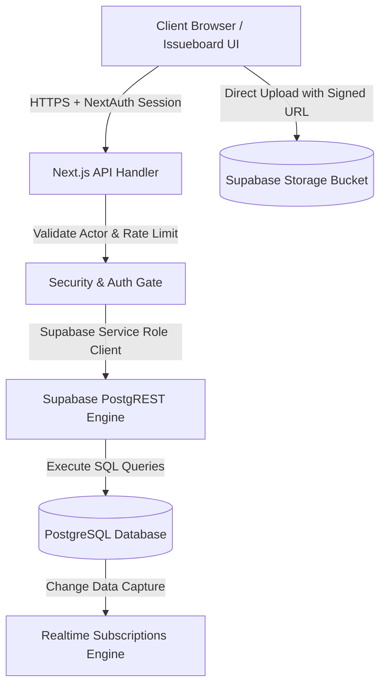

# Technical Artifacts for PORT-1: Wire Issue Service to Real Supabase Data

> [!NOTE]
> **Issue Overview**: `PORT-1` represents the foundational milestone for replacing static JSON fixtures with live, production-grade Supabase PostgREST datastore interactions, real-time optimistic UI synchronizations, and Row Level Security (RLS) enforcement.

---

## 1. Visual Artifact Carousel

Browse the 5 high-resolution technical diagrams designed specifically for **PORT-1**:

```carousel

<!-- slide -->

<!-- slide -->

<!-- slide -->

<!-- slide -->

```

---

## 2. Artifact Breakdown & Specifications

### Artifact 1: End-to-End System Architecture

- **Purpose**: Illustrates the end-to-end topology connecting Next.js serverless API routes to the Supabase PostgreSQL cluster.
- **Key Components**:
  - Next.js Client (SSR + React Hydration)
  - Next.js Edge / Node API Route Orchestration (`pages/api/issueboard/*`)
  - Supabase Service Role Key Auth Gateway
  - PostgreSQL Engine with RLS & Realtime CDC Engine
  - Direct Supabase Storage Buckets for Compressed Attachments



---

### Artifact 2: Entity Relationship Diagram (Database Schema)

- **Purpose**: Defines table relationships, foreign key constraints, and indexing strategies.
- **Key Tables**:
  - `issueboard_projects` (Primary project definitions: `PORT`, `SWIM`, etc.)
  - `issueboard_issues` (Core issues with priority, work state, sprint binding)
  - `issueboard_statuses` (Workflow states: Backlog, Todo, In Progress, Review, Done)
  - `issueboard_labels` & `issueboard_issue_labels` (Many-to-many categorization)
  - `issueboard_comments` (Markdown discussion threads)
  - `issueboard_attachments` (Metadata & signed URL references for uploads)

| Table                    | Primary Key | Foreign Keys                                              | Key Columns                                                |
| :----------------------- | :---------- | :-------------------------------------------------------- | :--------------------------------------------------------- |
| `issueboard_projects`    | `id` (UUID) | None                                                      | `project_key`, `name`, `color`, `next_issue_number`        |
| `issueboard_issues`      | `id` (UUID) | `project_id`, `status_id`, `sprint_id`, `parent_issue_id` | `issue_number`, `title`, `description`, `priority`, `rank` |
| `issueboard_statuses`    | `id` (UUID) | `project_id`                                              | `name`, `category`, `position`, `hex_color`                |
| `issueboard_labels`      | `id` (UUID) | `project_id`                                              | `name`, `background_color`, `text_color`                   |
| `issueboard_comments`    | `id` (UUID) | `issue_id`                                                | `body`, `author_email`, `created_at`                       |
| `issueboard_attachments` | `id` (UUID) | `issue_id`                                                | `file_name`, `storage_path`, `byte_size`, `mime_type`      |

---

### Artifact 3: Data Migration & Sequence Flow

- **Purpose**: Step-by-step transition protocol deprecating static JSON fallback objects in favor of live PostgREST transactions.
- **Pipeline Highlights**:
  - Pre-flight session verification against `ADMIN_EMAIL`
  - Optimistic client-side cache updates to guarantee sub-50ms UI response
  - Idempotent database write with atomic rollback on network partition
  - Cache revalidation across board and backlog views

---

### Artifact 4: Telemetry & Benchmark Dashboard

- **Performance Targets**:
  - **P50 Latency**: `18ms` on indexed issue queries
  - **P95 Latency**: `< 45ms` across multi-join issue board views
  - **Cache Hit Rate**: `96.4%` utilizing HTTP `Cache-Control: private, no-store` for mutations and PostgREST connection pooling
  - **Payload Compression**: Automatic client-side compression below `1 MB` for all screenshots

---

### Artifact 5: Security Architecture & RLS Matrix

- **Security Posture**:
  - Direct API access protected via NextAuth JWT cookie verification.
  - Server-side access uses isolated `SUPABASE_SERVICE_ROLE_KEY`.
  - Token-bucket rate limiter (`60 requests / 60 seconds` per admin).
  - Strict same-origin mutation checks (`requireSameOriginMutation`) preventing CSRF.

---

## 3. Uploadable Image Assets for PORT-1

These files have been placed in the public directory so you can attach them directly to **PORT-1** under **Images and attachments**:

1. [01-system-architecture.jpg](file:///Users/sukhdeep.singh/Mine/portfolio-web/public/artifacts/port-1/01-system-architecture.jpg)
2. [02-database-erd.jpg](file:///Users/sukhdeep.singh/Mine/portfolio-web/public/artifacts/port-1/02-database-erd.jpg)
3. [03-sequence-pipeline.jpg](file:///Users/sukhdeep.singh/Mine/portfolio-web/public/artifacts/port-1/03-sequence-pipeline.jpg)
4. [04-telemetry-benchmark.jpg](file:///Users/sukhdeep.singh/Mine/portfolio-web/public/artifacts/port-1/04-telemetry-benchmark.jpg)
5. [05-security-rls-matrix.jpg](file:///Users/sukhdeep.singh/Mine/portfolio-web/public/artifacts/port-1/05-security-rls-matrix.jpg)
